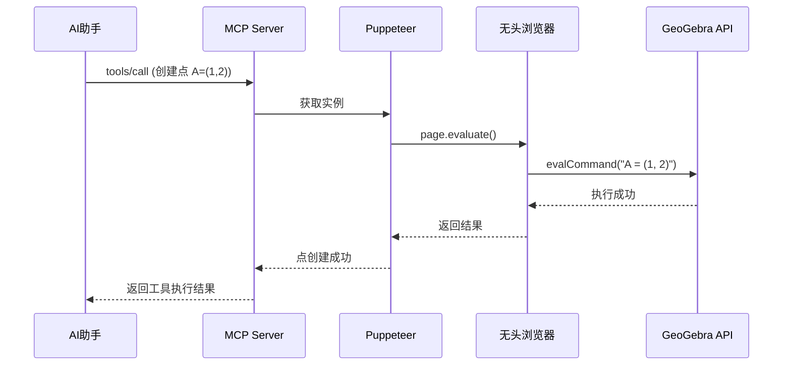

# GeoGebra MCP 项目架构与工作原理

## 📋 目录
- [项目概述](#项目概述)
- [核心原理](#核心原理)
- [GeoGebra API 接口](#geogebra-api-接口)
- [Puppeteer 交互机制](#puppeteer-交互机制)
- [完整交互流程](#完整交互流程)
- [技术架构图](#技术架构图)
- [关键代码解析](#关键代码解析)
- [性能优化](#性能优化)

---

## 项目概述

### 什么是 GeoGebra MCP？

GeoGebra MCP 是一个**模型上下文协议(Model Context Protocol)服务器**，它允许AI助手（如Claude、ChatGPT等）通过标准化的工具接口与GeoGebra数学软件进行交互，实现：

- ✅ 创建几何图形（点、线、圆、多边形）
- ✅ 绘制数学函数和图像  
- ✅ 执行代数计算（求导、积分、解方程）
- ✅ 导出可视化结果（PNG、SVG、PDF）
- ✅ 创建动画和交互式演示

### 项目定位

```
┌─────────────┐      MCP协议      ┌──────────────┐     Puppeteer     ┌──────────────┐
│ AI助手      │ ◄──────────────► │ MCP Server   │ ◄──────────────► │ GeoGebra     │
│ (Claude等)  │  JSON-RPC 2.0    │ (本项目)     │   Browser API    │ (Web版)      │
└─────────────┘                   └──────────────┘                   └──────────────┘
```

---

## 核心原理

### 1. 无头浏览器方案

本项目采用**Puppeteer + GeoGebra Web应用**的架构，而不是直接调用GeoGebra桌面应用或原生库。

**为什么选择这种方案？**

| 方案 | 优点 | 缺点 |
|------|------|------|
| **Puppeteer + Web** ✅ | 跨平台、不需要安装GeoGebra、API稳定 | 占用内存较大、需要网络访问 |
| 桌面应用调用 | 功能完整 | 需要安装、跨平台困难、自动化复杂 |
| 原生绑定 | 性能最佳 | 维护成本高、GeoGebra无官方Node.js库 |

### 2. 工作流程概览



### 3. 三层架构

```
┌───────────────────────────────────────────────────────────┐
│ 应用层 (Application Layer)                                │
│ • MCP Server (server.ts)                                  │
│ • 工具注册表 (tools/index.ts)                             │
│ • 工具实现 (geogebra-tools.ts)                            │
└───────────────────────────────────────────────────────────┘
                        ↓
┌───────────────────────────────────────────────────────────┐
│ 抽象层 (Abstraction Layer)                                │
│ • GeoGebraInstance 类 (geogebra-instance.ts)             │
│ • 实例池管理 (instance-pool.ts)                           │
│ • 错误处理和验证 (validation.ts, errors.ts)              │
└───────────────────────────────────────────────────────────┘
                        ↓
┌───────────────────────────────────────────────────────────┐
│ 基础设施层 (Infrastructure Layer)                         │
│ • Puppeteer 浏览器控制                                    │
│ • GeoGebra Web Apps API                                   │
│ • Chrome/Chromium 无头浏览器                              │
└───────────────────────────────────────────────────────────┘
```

---

## GeoGebra API 接口

### GeoGebra Apps API 简介

GeoGebra提供了**官方的Web应用API**，这是本项目能够工作的基础。

**官方文档**: https://geogebra.github.io/docs/reference/en/GeoGebra_Apps_API/

### API 加载方式

项目通过CDN加载GeoGebra：

```html
<!-- 在生成的HTML页面中 -->
<script src="https://www.geogebra.org/apps/deployggb.js"></script>
```

### 核心API方法

| API方法 | 功能 | 项目中的使用 |
|---------|------|-------------|
| `evalCommand(cmd)` | 执行GeoGebra命令 | 创建对象、设置属性 |
| `getPNGBase64()` | 导出PNG图像 | 图像导出功能 |
| `exportSVG()` | 导出SVG | 矢量图导出 |
| `getAllObjectNames()` | 获取所有对象 | 查询构造内容 |
| `getObjectType()` | 获取对象类型 | 对象信息查询 |
| `getValue()` / `setValue()` | 获取/设置对象值 | 动画和参数控制 |
| `setAnimating()` | 设置动画 | 动画功能 |
| `exists()` / `deleteObject()` | 检查/删除对象 | 对象管理 |

### API 初始化过程

```javascript
// 在生成的HTML中的初始化代码
const parameters = {
    "appName": "classic",          // 使用经典版（完整功能）
    "width": 800,
    "height": 600,
    "showMenuBar": false,
    "showToolBar": false,
    "showAlgebraInput": false,
    "enableCAS": true,             // 启用计算机代数系统
    "language": "en",
    "appletOnLoad": function(api) {
        window.ggbApplet = api;    // 暴露API到全局
        window.ggbReady = true;
    }
};

const applet = new GGBApplet(parameters, true);
applet.inject('ggb-element');
```

---

## Puppeteer 交互机制

### 1. 浏览器实例生命周期

```typescript
// src/utils/geogebra-instance.ts
export class GeoGebraInstance implements GeoGebraAPI {
  private browser?: Browser;
  private page?: Page;
  
  async initialize(headless: boolean = true): Promise<void> {
    // 1. 启动浏览器
    this.browser = await puppeteer.launch({
      headless,
      args: [
        '--no-sandbox',
        '--disable-setuid-sandbox',
        '--disable-dev-shm-usage',
        // ... 其他优化参数
      ]
    });
    
    // 2. 创建新页面
    this.page = await this.browser.newPage();
    
    // 3. 设置视口大小
    await this.page.setViewport({ width: 800, height: 600 });
    
    // 4. 加载GeoGebra HTML
    await this.loadGeoGebra();
    
    // 5. 等待GeoGebra就绪
    await this.waitForReady();
  }
}
```

### 2. HTML页面生成

```typescript
private generateAppletHTML(): string {
  return `
<!DOCTYPE html>
<html>
<head>
    <title>GeoGebra Applet</title>
    <script src="https://www.geogebra.org/apps/deployggb.js"></script>
</head>
<body>
    <div id="ggb-element"></div>
    <script>
        // 全局变量用于状态检查
        window.ggbReady = false;
        window.ggbApplet = null;
        
        // GeoGebra参数配置
        const parameters = {
            "appName": "classic",
            "width": ${this.config.width},
            "height": ${this.config.height},
            // ... 更多配置
            "appletOnLoad": function(api) {
                window.ggbApplet = api;
                window.ggbReady = true;
            }
        };
        
        // 注入GeoGebra应用
        const applet = new GGBApplet(parameters, true);
        applet.inject('ggb-element');
    </script>
</body>
</html>`;
}
```

### 3. 命令执行机制

通过 `page.evaluate()` 在浏览器上下文中执行JavaScript代码：

```typescript
async evalCommand(command: string): Promise<GeoGebraCommandResult> {
  // 在浏览器页面的JavaScript上下文中执行
  const result = await this.page!.evaluate((cmd) => {
    try {
      // 调用GeoGebra API
      const success = window.ggbApplet.evalCommand(cmd);
      
      // 尝试获取返回值
      let result = undefined;
      if (success) {
        try {
          result = window.ggbApplet.getValue(cmd);
        } catch (e) {
          // 某些命令可能没有返回值
        }
      }
      
      return {
        success: success,
        result: result,
        error: success ? undefined : 'Command execution failed'
      };
    } catch (error) {
      return {
        success: false,
        result: undefined,
        error: error.message || 'Unknown error'
      };
    }
  }, command); // 传递参数到浏览器上下文
  
  return result;
}
```

### 4. 数据导出机制

**PNG导出示例：**

```typescript
async exportPNG(scale: number = 1, transparent: boolean = false): Promise<string> {
  // 在浏览器上下文中获取base64编码的PNG
  const pngBase64 = await this.page!.evaluate((scale, transparent) => {
    const applet = window.ggbApplet;
    
    // 调用GeoGebra的PNG导出API
    const result = applet.getPNGBase64(scale, transparent);
    
    return result; // 返回base64字符串
  }, scale, transparent);
  
  // 验证返回数据
  if (!pngBase64 || typeof pngBase64 !== 'string') {
    throw new Error('PNG export failed');
  }
  
  return pngBase64;
}
```

**PDF导出（使用浏览器原生功能）：**

```typescript
async exportPDF(): Promise<string> {
  // 使用Puppeteer的PDF生成功能
  const pdf = await this.page!.pdf({
    format: 'A4',
    printBackground: true,
    margin: {
      top: '0.5in',
      bottom: '0.5in',
      left: '0.5in',
      right: '0.5in'
    }
  });
  
  return pdf.toString('base64');
}
```

---

## 完整交互流程

### 场景1：AI助手创建一个点

```
┌─────────────────────────────────────────────────────────────────┐
│ 1. AI请求 (通过MCP协议)                                          │
├─────────────────────────────────────────────────────────────────┤
│ {                                                               │
│   "jsonrpc": "2.0",                                             │
│   "method": "tools/call",                                       │
│   "params": {                                                   │
│     "name": "geogebra_create_point",                            │
│     "arguments": { "name": "A", "x": 3, "y": 4 }                │
│   }                                                             │
│ }                                                               │
└─────────────────────────────────────────────────────────────────┘
                           ↓
┌─────────────────────────────────────────────────────────────────┐
│ 2. MCP Server 路由请求                                           │
├─────────────────────────────────────────────────────────────────┤
│ • server.ts 接收JSON-RPC请求                                    │
│ • 调用 toolRegistry.executeTool()                               │
│ • 找到 geogebra_create_point 工具处理器                         │
└─────────────────────────────────────────────────────────────────┘
                           ↓
┌─────────────────────────────────────────────────────────────────┐
│ 3. 工具处理器 (geogebra-tools.ts)                               │
├─────────────────────────────────────────────────────────────────┤
│ • 验证参数：validateObjectName("A")                             │
│ • 验证参数：validateCoordinates(3, 4)                           │
│ • 构造命令：command = "A = (3, 4)"                              │
│ • 获取GeoGebra实例                                               │
└─────────────────────────────────────────────────────────────────┘
                           ↓
┌─────────────────────────────────────────────────────────────────┐
│ 4. 实例池管理 (instance-pool.ts)                                │
├─────────────────────────────────────────────────────────────────┤
│ • 检查是否有默认实例                                             │
│ • 如果没有，创建新实例                                           │
│   - 启动Puppeteer浏览器                                         │
│   - 加载GeoGebra HTML                                            │
│   - 等待初始化完成                                               │
│ • 返回可用实例                                                   │
└─────────────────────────────────────────────────────────────────┘
                           ↓
┌─────────────────────────────────────────────────────────────────┐
│ 5. 命令执行 (geogebra-instance.ts)                              │
├─────────────────────────────────────────────────────────────────┤
│ await instance.evalCommand("A = (3, 4)")                        │
│                                                                 │
│ 内部实现：                                                       │
│ const result = await page.evaluate((cmd) => {                  │
│   const success = window.ggbApplet.evalCommand(cmd);           │
│   return { success, result: ..., error: ... };                 │
│ }, "A = (3, 4)");                                               │
└─────────────────────────────────────────────────────────────────┘
                           ↓
┌─────────────────────────────────────────────────────────────────┐
│ 6. 浏览器上下文 (Chrome + GeoGebra)                              │
├─────────────────────────────────────────────────────────────────┤
│ • JavaScript代码在浏览器页面中执行                              │
│ • 调用 window.ggbApplet.evalCommand("A = (3, 4)")              │
│ • GeoGebra在其Canvas上创建点A                                   │
│ • 返回执行结果到Puppeteer                                        │
└─────────────────────────────────────────────────────────────────┘
                           ↓
┌─────────────────────────────────────────────────────────────────┐
│ 7. 获取对象信息                                                  │
├─────────────────────────────────────────────────────────────────┤
│ const pointInfo = await instance.getObjectInfo("A")             │
│                                                                 │
│ 返回：                                                           │
│ {                                                               │
│   name: "A",                                                    │
│   type: "point",                                                │
│   visible: true,                                                │
│   x: 3,                                                         │
│   y: 4,                                                         │
│   value: "(3, 4)"                                               │
│ }                                                               │
└─────────────────────────────────────────────────────────────────┘
                           ↓
┌─────────────────────────────────────────────────────────────────┐
│ 8. 响应给AI (MCP协议)                                            │
├─────────────────────────────────────────────────────────────────┤
│ {                                                               │
│   "jsonrpc": "2.0",                                             │
│   "id": 123,                                                    │
│   "result": {                                                   │
│     "content": [{                                               │
│       "type": "text",                                           │
│       "text": "{                                                │
│         \"success\": true,                                      │
│         \"command\": \"A = (3, 4)\",                            │
│         \"point\": { ... }                                      │
│       }"                                                        │
│     }]                                                          │
│   }                                                             │
│ }                                                               │
└─────────────────────────────────────────────────────────────────┘
```

### 场景2：导出PNG图像

```
1. 用户: "将当前构造导出为PNG"
   ↓
2. AI调用: geogebra_export_png { scale: 2, transparent: false }
   ↓
3. 实例执行:
   - 设置视图参数（坐标系、轴、网格）
   - 调用 instance.exportPNG(2, false)
   ↓
4. Puppeteer执行:
   await page.evaluate((scale, transparent) => {
     return window.ggbApplet.getPNGBase64(scale, transparent);
   }, 2, false);
   ↓
5. GeoGebra API:
   - 在Canvas上渲染当前状态
   - 转换为PNG格式
   - 编码为Base64字符串
   ↓
6. 返回Base64数据:
   "iVBORw0KGgoAAAANSUhEUgAAA..."
   ↓
7. AI收到结果并可以：
   - 保存为文件
   - 嵌入到文档
   - 显示给用户
```

---

## 技术架构图

### 系统组件关系

```
┌────────────────────────────────────────────────────────────────┐
│                          外部接口层                             │
│  ┌──────────────┐   ┌──────────────┐   ┌──────────────┐      │
│  │ Claude API   │   │ OpenAI API   │   │ 其他AI平台   │      │
│  └──────┬───────┘   └──────┬───────┘   └──────┬───────┘      │
└─────────┼──────────────────┼──────────────────┼───────────────┘
          │                  │                  │
          └──────────────────┴──────────────────┘
                             │ MCP协议 (JSON-RPC 2.0)
┌────────────────────────────┼───────────────────────────────────┐
│                       MCP Server 层                            │
│  ┌────────────────────────┴───────────────────────────────┐   │
│  │              server.ts (MCP Server)                     │   │
│  │  • 接收JSON-RPC请求                                     │   │
│  │  • 路由到工具处理器                                      │   │
│  │  • 返回标准化响应                                        │   │
│  └────────────────────┬───────────────────────────────────┘   │
│                       │                                        │
│  ┌────────────────────┴───────────────────────────────────┐   │
│  │          tools/index.ts (工具注册表)                    │   │
│  │  • 工具发现 (tools/list)                                │   │
│  │  • 工具执行 (tools/call)                                │   │
│  │  • 错误处理                                              │   │
│  └────────────────────┬───────────────────────────────────┘   │
└───────────────────────┼────────────────────────────────────────┘
                        │
┌───────────────────────┼────────────────────────────────────────┐
│                    业务逻辑层                                   │
│  ┌────────────────────┴───────────────────────────────────┐   │
│  │   geogebra-tools.ts (40+ 工具实现)                      │   │
│  │  ┌──────────────┐  ┌──────────────┐  ┌──────────────┐ │   │
│  │  │ 基础工具     │  │ 绘图工具     │  │ CAS工具      │ │   │
│  │  │ - 创建点     │  │ - 函数绘制   │  │ - 求导       │ │   │
│  │  │ - 创建线     │  │ - 参数曲线   │  │ - 积分       │ │   │
│  │  │ - 创建圆     │  │ - 隐式曲线   │  │ - 解方程     │ │   │
│  │  └──────────────┘  └──────────────┘  └──────────────┘ │   │
│  │  ┌──────────────┐  ┌──────────────┐  ┌──────────────┐ │   │
│  │  │ 导出工具     │  │ 动画工具     │  │ 教育工具     │ │   │
│  │  │ - PNG导出    │  │ - 滑块创建   │  │ - 模板       │ │   │
│  │  │ - SVG导出    │  │ - 动画控制   │  │ - 课程计划   │ │   │
│  │  │ - PDF导出    │  │ - 轨迹追踪   │  │ - 示例      │ │   │
│  │  └──────────────┘  └──────────────┘  └──────────────┘ │   │
│  └────────────────────┬───────────────────────────────────┘   │
└───────────────────────┼────────────────────────────────────────┘
                        │
┌───────────────────────┼────────────────────────────────────────┐
│                    抽象层                                       │
│  ┌────────────────────┴───────────────────────────────────┐   │
│  │  GeoGebraInstance (geogebra-instance.ts)                │   │
│  │  • 实例管理                                              │   │
│  │  • 命令执行: evalCommand()                               │   │
│  │  • 对象查询: getObjectInfo()                             │   │
│  │  • 导出功能: exportPNG/SVG/PDF()                         │   │
│  │  • 动画控制: setAnimating(), startAnimation()            │   │
│  └────────────────────┬───────────────────────────────────┘   │
│                       │                                        │
│  ┌────────────────────┴───────────────────────────────────┐   │
│  │  实例池 (instance-pool.ts)                              │   │
│  │  • 实例创建和初始化                                      │   │
│  │  • 实例复用                                              │   │
│  │  • 生命周期管理                                          │   │
│  └────────────────────┬───────────────────────────────────┘   │
│                       │                                        │
│  ┌────────────────────┴───────────────────────────────────┐   │
│  │  辅助模块                                                │   │
│  │  • validation.ts - 参数验证                              │   │
│  │  • errors.ts - 错误处理                                  │   │
│  │  • logger.ts - 日志记录                                  │   │
│  └────────────────────┬───────────────────────────────────┘   │
└───────────────────────┼────────────────────────────────────────┘
                        │
┌───────────────────────┼────────────────────────────────────────┐
│                    基础设施层                                   │
│  ┌────────────────────┴───────────────────────────────────┐   │
│  │              Puppeteer                                  │   │
│  │  • 浏览器控制                                            │   │
│  │  • 页面自动化                                            │   │
│  │  • page.evaluate() - JavaScript注入                     │   │
│  └────────────────────┬───────────────────────────────────┘   │
│                       │                                        │
│  ┌────────────────────┴───────────────────────────────────┐   │
│  │         Chrome/Chromium (无头模式)                       │   │
│  │  ┌─────────────────────────────────────────────────┐   │   │
│  │  │  HTML页面上下文                                  │   │   │
│  │  │  ┌─────────────────────────────────────────┐   │   │   │
│  │  │  │  GeoGebra Web应用                       │   │   │   │
│  │  │  │  • window.ggbApplet (API对象)           │   │   │   │
│  │  │  │  • Canvas渲染                           │   │   │   │
│  │  │  │  • CAS计算引擎                          │   │   │   │
│  │  │  └─────────────────────────────────────────┘   │   │   │
│  │  └─────────────────────────────────────────────────┘   │   │
│  └────────────────────────────────────────────────────────┘   │
└────────────────────────────────────────────────────────────────┘
```

---

## 关键代码解析

### 1. 实例池管理

**为什么需要实例池？**

- 每次创建新的浏览器实例很慢（~2-3秒）
- 资源占用大（每个实例约100-150MB内存）
- 实例复用可以大幅提升性能

**实现方式：**

```typescript
// src/tools/geogebra-tools.ts (简化版)
class GeoGebraInstancePool {
  private defaultInstance: GeoGebraInstance | undefined;

  async getDefaultInstance(): Promise<GeoGebraInstance> {
    if (!this.defaultInstance) {
      // 第一次调用时创建实例
      this.defaultInstance = new GeoGebraInstance({
        appName: 'classic',
        width: 800,
        height: 600,
        showMenuBar: false,
        showToolBar: false,
      });
      
      // 初始化（启动浏览器，加载GeoGebra）
      await this.defaultInstance.initialize(true);
      logger.info('Default GeoGebra instance initialized');
    }
    
    // 后续调用直接返回已有实例
    return this.defaultInstance;
  }

  async cleanup(): Promise<void> {
    if (this.defaultInstance) {
      await this.defaultInstance.cleanup();
      this.defaultInstance = undefined;
    }
  }
}

const instancePool = new GeoGebraInstancePool();

// 进程退出时清理
process.on('exit', () => instancePool.cleanup());
process.on('SIGINT', () => {
  instancePool.cleanup();
  process.exit(0);
});
```

### 2. 命令执行的错误处理

```typescript
async evalCommand(command: string): Promise<GeoGebraCommandResult> {
  this.ensureInitialized(); // 确保实例已初始化
  this.updateActivity();     // 更新最后活动时间

  try {
    // 检查applet是否可用
    const appletCheck = await this.page!.evaluate(() => {
      return {
        appletExists: !!window.ggbApplet,
        evalCommandExists: typeof window.ggbApplet?.evalCommand === 'function'
      };
    });
    
    if (!appletCheck.appletExists || !appletCheck.evalCommandExists) {
      throw new Error(`GeoGebra applet not available`);
    }
    
    // 执行命令
    const result = await this.page!.evaluate((cmd) => {
      try {
        const success = window.ggbApplet.evalCommand(cmd);
        
        // 尝试获取结果值
        let result = undefined;
        if (success) {
          try {
            result = window.ggbApplet.getValue(cmd);
          } catch (e) {
            // 某些命令没有返回值
          }
        }
        
        return {
          success: success,
          result: result,
          error: success ? undefined : 'Command execution failed'
        };
      } catch (error) {
        return {
          success: false,
          result: undefined,
          error: error.message || 'Unknown error'
        };
      }
    }, command);

    if (!result.success) {
      throw new GeoGebraCommandError(result.error || 'Command failed', command);
    }

    return result;
  } catch (error) {
    logger.error(`Command execution failed`, { command, error });
    throw new GeoGebraCommandError(
      `Failed to execute command: ${error.message}`,
      command
    );
  }
}
```

### 3. 参数验证机制

```typescript
// src/utils/validation.ts
export function validateObjectName(name: string): ValidationResult {
  if (!name || typeof name !== 'string') {
    return { isValid: false, error: 'Name must be a non-empty string' };
  }
  
  if (!/^[a-zA-Z][a-zA-Z0-9_]*$/.test(name)) {
    return { 
      isValid: false, 
      error: 'Name must start with a letter and contain only letters, numbers, and underscores' 
    };
  }
  
  if (name.length > 50) {
    return { isValid: false, error: 'Name is too long (max 50 characters)' };
  }
  
  return { isValid: true };
}

export function validateCoordinates(x: number, y: number, z?: number): ValidationResult {
  if (typeof x !== 'number' || typeof y !== 'number') {
    return { isValid: false, error: 'Coordinates must be numbers' };
  }
  
  if (!isFinite(x) || !isFinite(y)) {
    return { isValid: false, error: 'Coordinates must be finite numbers' };
  }
  
  if (z !== undefined && (!isFinite(z) || typeof z !== 'number')) {
    return { isValid: false, error: 'Z coordinate must be a finite number' };
  }
  
  return { isValid: true };
}
```

---

## 性能优化

### 1. 实例复用策略

```typescript
// ✅ 好的做法：复用实例
const instance = await instancePool.getDefaultInstance();
await instance.evalCommand("A = (1, 2)");
await instance.evalCommand("B = (3, 4)");
await instance.evalCommand("l = Line(A, B)");

// ❌ 坏的做法：每次创建新实例
for (let i = 0; i < 10; i++) {
  const instance = new GeoGebraInstance();
  await instance.initialize();  // 每次都要等2-3秒
  await instance.evalCommand(`P${i} = (${i}, ${i})`);
  await instance.cleanup();
}
```

### 2. 批量操作优化

```typescript
// ✅ 好的做法：批量执行命令
async function createMultiplePoints(points: Array<{name: string, x: number, y: number}>) {
  const instance = await instancePool.getDefaultInstance();
  
  for (const point of points) {
    await instance.evalCommand(`${point.name} = (${point.x}, ${point.y})`);
  }
  
  // 一次性刷新视图
  await instance.refreshViews();
}

// ❌ 坏的做法：每个点都刷新视图
async function createPointsSlowly(points: Array<{name: string, x: number, y: number}>) {
  const instance = await instancePool.getDefaultInstance();
  
  for (const point of points) {
    await instance.evalCommand(`${point.name} = (${point.x}, ${point.y})`);
    await instance.refreshViews(); // 每次都刷新，很慢
  }
}
```

### 3. 导出优化

```typescript
// GEB-17: 增强的PNG导出，带重试机制
async exportPNG(scale: number = 1, transparent: boolean = false): Promise<string> {
  // 1. 验证导出准备状态
  const readiness = await this.validateExportReadiness('png');
  if (!readiness.ready) {
    throw new GeoGebraError(`PNG export not ready: ${readiness.issues.join(', ')}`);
  }

  // 2. 重试机制
  return this.retryOperation(async () => {
    const pngBase64 = await this.page!.evaluate((scale, transparent) => {
      const applet = window.ggbApplet;
      
      // 尝试多种方法
      let result = null;
      
      // 方法1: 完整参数
      try {
        result = applet.getPNGBase64(scale, transparent);
        if (result && result.length > 0) return result;
      } catch (e) {}
      
      // 方法2: 无透明度参数
      try {
        result = applet.getPNGBase64(scale);
        if (result && result.length > 0) return result;
      } catch (e) {}
      
      // 方法3: 默认参数
      try {
        result = applet.getPNGBase64(1);
        if (result && result.length > 0) return result;
      } catch (e) {}
      
      throw new Error('All export methods failed');
    }, scale, transparent);
    
    // 3. 验证结果
    if (!pngBase64 || pngBase64.length < 100) {
      throw new Error('Invalid PNG data');
    }
    
    return pngBase64;
  }, 3, 1000, 'PNG export'); // 最多重试3次，间隔1秒
}
```

### 4. 内存管理

```typescript
// 定期清理资源
class GeoGebraInstance {
  private lastActivity: Date = new Date();
  
  private updateActivity(): void {
    this.lastActivity = new Date();
  }
  
  isIdle(timeoutMs: number = 300000): boolean {
    const now = new Date();
    return (now.getTime() - this.lastActivity.getTime()) > timeoutMs;
  }
}

// 在实例池中实现自动清理
class GeoGebraInstancePool {
  private cleanupInterval?: NodeJS.Timeout;
  
  constructor() {
    // 每5分钟检查一次空闲实例
    this.cleanupInterval = setInterval(() => {
      this.cleanupIdleInstances();
    }, 5 * 60 * 1000);
  }
  
  private async cleanupIdleInstances() {
    for (const [id, instance] of this.instances) {
      if (instance.isIdle(30 * 60 * 1000)) { // 30分钟不活动
        logger.info(`Cleaning up idle instance: ${id}`);
        await instance.cleanup();
        this.instances.delete(id);
      }
    }
  }
}
```

---

## 常见问题

### Q1: package.json中的 @gebrai/gebrai 依赖是什么？

**A**: 这是一个**配置错误**。项目不应该依赖自己。这个依赖应该被移除或者是指向其他包。

```json
{
  "dependencies": {
    "@gebrai/gebrai": "^1.0.1",  // ❌ 错误：循环依赖
    "puppeteer": "^22.15.0",      // ✅ 正确
    // ... 其他依赖
  }
}
```

**正确的做法**：
- 如果是用于测试，应该放在 devDependencies
- 如果是真正的外部依赖，应该确认包名是否正确
- 很可能应该直接删除这个依赖

### Q2: 为什么不使用GeoGebra桌面应用？

**A**: 主要原因：
1. **跨平台兼容性**：Web版可以在任何有浏览器的地方运行
2. **自动化友好**：Puppeteer提供完整的自动化API
3. **部署简单**：不需要安装GeoGebra桌面应用
4. **稳定的API**：GeoGebra Apps API是官方维护的公开接口

### Q3: 内存占用如何？

**A**: 单个实例约占用：
- 浏览器进程：80-120MB
- Node.js进程：30-50MB
- 总计：约110-170MB

通过实例池复用，可以避免频繁创建销毁实例。

### Q4: 如何扩展支持更多工具？

**A**: 在 `src/tools/geogebra-tools.ts` 中添加新工具：

```typescript
{
  tool: {
    name: 'geogebra_my_new_tool',
    description: '...',
    inputSchema: { ... }
  },
  handler: async (params) => {
    // 1. 验证参数
    // 2. 获取实例
    const instance = await instancePool.getDefaultInstance();
    // 3. 执行GeoGebra命令
    // 4. 返回结果
  }
}
```

---

## 总结

### 核心技术栈

1. **MCP协议** - AI助手与工具的标准通信协议
2. **Puppeteer** - 无头浏览器自动化
3. **GeoGebra Apps API** - 官方Web应用接口
4. **TypeScript** - 类型安全的开发

### 工作流程简述

```
AI请求 → MCP Server → 工具处理器 → 实例池 
→ Puppeteer → Chrome浏览器 → GeoGebra API 
→ 执行命令 → 返回结果 → MCP响应 → AI收到结果
```

### 优势

- ✅ 跨平台兼容
- ✅ 无需安装GeoGebra
- ✅ 稳定的官方API
- ✅ 完整的数学功能
- ✅ 实例复用高效

### 局限性

- ⚠️ 需要网络访问（加载GeoGebra）
- ⚠️ 内存占用较大
- ⚠️ 首次启动较慢（~2-3秒）
- ⚠️ 依赖浏览器环境

---

**文档版本**: 1.0  
**最后更新**: 2025年10月  
**作者**: GeoGebra MCP 项目团队

