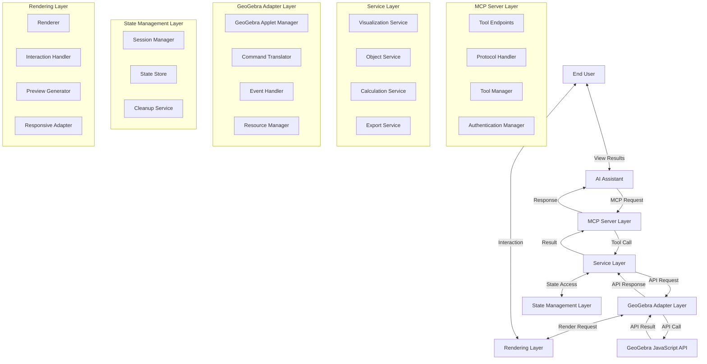

```mermaid
graph TD
    %% Main Components
    AI[AI Assistant] --> |MCP Request| MCP[MCP Server Layer]
    MCP --> |Response| AI
    MCP --> |Tool Call| SL[Service Layer]
    SL --> |Result| MCP
    SL --> |API Request| GA[GeoGebra Adapter Layer]
    GA --> |API Response| SL
    GA --> |API Call| GG[GeoGebra JavaScript API]
    GG --> |API Result| GA
    SL <--> |State Access| SM[State Management Layer]
    GA <--> |Render Request| RL[Rendering Layer]
    
    %% MCP Server Layer Components
    subgraph "MCP Server Layer"
        TE[Tool Endpoints]
        PR[Protocol Handler]
        TM[Tool Manager]
        AM[Authentication Manager]
    end
    
    %% Service Layer Components
    subgraph "Service Layer"
        VS[Visualization Service]
        OS[Object Service]
        CS[Calculation Service]
        ES[Export Service]
    end
    
    %% GeoGebra Adapter Layer Components
    subgraph "GeoGebra Adapter Layer"
        GAM[GeoGebra Applet Manager]
        CT[Command Translator]
        EH[Event Handler]
        RM[Resource Manager]
    end
    
    %% State Management Layer Components
    subgraph "State Management Layer"
        SMG[Session Manager]
        SS[State Store]
        CS2[Cleanup Service]
    end
    
    %% Rendering Layer Components
    subgraph "Rendering Layer"
        RD[Renderer]
        IH[Interaction Handler]
        PG[Preview Generator]
        RA[Responsive Adapter]
    end
    
    %% Data Flow for Visualization Creation
    classDef flow fill:#f9f,stroke:#333,stroke-width:1px;
    class DF1,DF2,DF3,DF4,DF5,DF6,DF7,DF8,DF9 flow;
    
    %% User Interaction
    User[End User] <--> |Interaction| RL
    User <--> |View Results| AI
```

