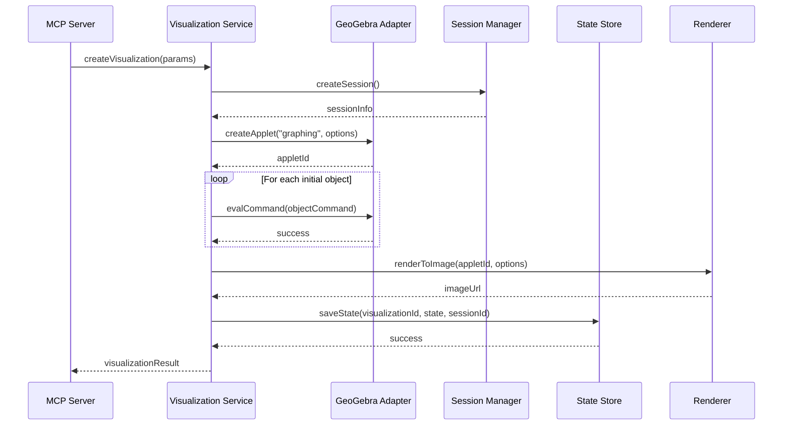
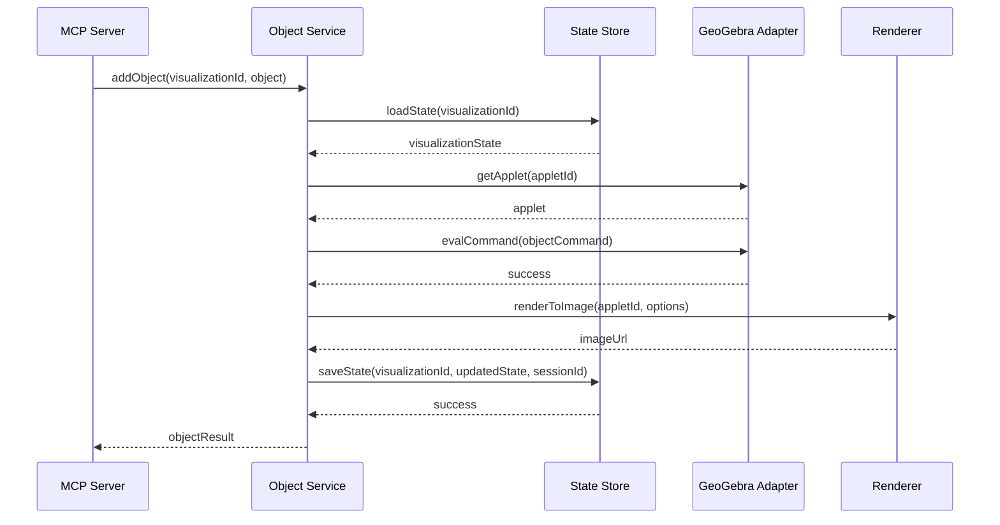

# Component Interfaces and Design Patterns: MCP-GeoGebra Integration

This document defines the interfaces between components in the MCP-GeoGebra integration architecture and outlines the design patterns to be used in implementation. It serves as a technical specification for developers implementing the system.

## 1. Component Interface Definitions

### 1.1 MCP Server Layer Interfaces

#### 1.1.1 Tool Endpoints Interface

```typescript
interface ToolEndpoints {
  /**
   * Lists available tools provided by the server
   */
  listTools(): Promise<ToolDefinition[]>;
  
  /**
   * Executes a tool with the provided parameters
   * @param toolName Name of the tool to execute
   * @param parameters Tool-specific parameters
   * @returns Tool execution result
   */
  callTool(toolName: string, parameters: any): Promise<ToolResult>;
}

interface ToolDefinition {
  name: string;
  description: string;
  inputSchema: JSONSchema;
  examples?: ToolExample[];
}

interface ToolResult {
  content: ContentItem[];
  isError?: boolean;
  errorCode?: string;
  errorDetails?: any;
}

interface ContentItem {
  type: "text" | "image" | "html" | "geogebra";
  text?: string;
  url?: string;
  html?: string;
  geogebraState?: string;
  alt?: string;
}

interface ToolExample {
  description: string;
  parameters: any;
  result: ContentItem[];
}
```

#### 1.1.2 Protocol Handler Interface

```typescript
interface ProtocolHandler {
  /**
   * Initializes the MCP protocol connection
   * @param capabilities Client capabilities
   * @returns Server capabilities
   */
  initialize(capabilities: ClientCapabilities): Promise<ServerCapabilities>;
  
  /**
   * Handles incoming MCP requests
   * @param request MCP request object
   * @returns MCP response object
   */
  handleRequest(request: MCPRequest): Promise<MCPResponse>;
  
  /**
   * Sends notifications to the client
   * @param notification Notification object
   */
  sendNotification(notification: MCPNotification): Promise<void>;
  
  /**
   * Closes the MCP connection
   */
  close(): Promise<void>;
}

interface ClientCapabilities {
  protocolVersion: string;
  supportedTransports: string[];
  features: string[];
}

interface ServerCapabilities {
  protocolVersion: string;
  supportedTransports: string[];
  features: string[];
  tools: ToolDefinition[];
}
```

### 1.2 Service Layer Interfaces

#### 1.2.1 Visualization Service Interface

```typescript
interface VisualizationService {
  /**
   * Creates a new visualization
   * @param params Visualization parameters
   * @param sessionId Optional session ID for state management
   * @returns Created visualization details
   */
  createVisualization(params: VisualizationParams, sessionId?: string): Promise<VisualizationResult>;
  
  /**
   * Updates an existing visualization
   * @param visualizationId ID of the visualization to update
   * @param params New visualization parameters
   * @returns Updated visualization details
   */
  updateVisualization(visualizationId: string, params: VisualizationParams): Promise<VisualizationResult>;
  
  /**
   * Deletes a visualization
   * @param visualizationId ID of the visualization to delete
   */
  deleteVisualization(visualizationId: string): Promise<void>;
}

interface VisualizationParams {
  type: "graph" | "geometry" | "3d" | "cas";
  title?: string;
  width?: number;
  height?: number;
  showGrid?: boolean;
  showAxes?: boolean;
  xRange?: [number, number];
  yRange?: [number, number];
  zRange?: [number, number];
  initialObjects?: MathObject[];
}

interface VisualizationResult {
  visualizationId: string;
  sessionId: string;
  imageUrl: string;
  interactiveUrl?: string;
  objects: MathObjectInfo[];
}

interface MathObject {
  type: "point" | "line" | "function" | "circle" | "polygon";
  definition: string;
  label?: string;
  color?: string;
  style?: any;
}

interface MathObjectInfo extends MathObject {
  id: string;
  coordinates?: number[];
  value?: number | string;
}
```

#### 1.2.2 Object Service Interface

```typescript
interface ObjectService {
  /**
   * Adds a mathematical object to a visualization
   * @param visualizationId ID of the visualization
   * @param object Object to add
   * @returns Added object information
   */
  addObject(visualizationId: string, object: MathObject): Promise<MathObjectInfo>;
  
  /**
   * Updates a mathematical object in a visualization
   * @param visualizationId ID of the visualization
   * @param objectId ID of the object to update
   * @param updates Object property updates
   * @returns Updated object information
   */
  updateObject(visualizationId: string, objectId: string, updates: Partial<MathObject>): Promise<MathObjectInfo>;
  
  /**
   * Removes a mathematical object from a visualization
   * @param visualizationId ID of the visualization
   * @param objectId ID of the object to remove
   */
  removeObject(visualizationId: string, objectId: string): Promise<void>;
  
  /**
   * Gets information about a mathematical object
   * @param visualizationId ID of the visualization
   * @param objectId ID of the object
   * @returns Object information
   */
  getObjectInfo(visualizationId: string, objectId: string): Promise<MathObjectInfo>;
}
```

#### 1.2.3 Calculation Service Interface

```typescript
interface CalculationService {
  /**
   * Evaluates a mathematical expression
   * @param expression Expression to evaluate
   * @param variables Variable values for substitution
   * @returns Evaluation result
   */
  evaluateExpression(expression: string, variables?: Record<string, number>): Promise<CalculationResult>;
  
  /**
   * Solves an equation or system of equations
   * @param equation Equation to solve
   * @param variable Variable to solve for
   * @returns Solution result
   */
  solveEquation(equation: string, variable: string): Promise<CalculationResult>;
  
  /**
   * Calculates the derivative of a function
   * @param function Function to differentiate
   * @param variable Variable to differentiate with respect to
   * @returns Derivative result
   */
  calculateDerivative(function: string, variable: string): Promise<CalculationResult>;
  
  /**
   * Calculates the integral of a function
   * @param function Function to integrate
   * @param variable Variable to integrate with respect to
   * @param lowerBound Optional lower bound for definite integral
   * @param upperBound Optional upper bound for definite integral
   * @returns Integration result
   */
  calculateIntegral(function: string, variable: string, lowerBound?: number, upperBound?: number): Promise<CalculationResult>;
}

interface CalculationResult {
  result: string | number | string[];
  latex?: string;
  steps?: CalculationStep[];
  visualizationId?: string;
  error?: string;
}

interface CalculationStep {
  description: string;
  expression: string;
  latex?: string;
}
```

### 1.3 GeoGebra Adapter Layer Interfaces

#### 1.3.1 GeoGebra Applet Manager Interface

```typescript
interface GeoGebraAppletManager {
  /**
   * Creates a new GeoGebra applet instance
   * @param type Type of GeoGebra applet
   * @param options Applet configuration options
   * @returns Applet instance ID
   */
  createApplet(type: "graphing" | "geometry" | "3d" | "cas", options: AppletOptions): Promise<string>;
  
  /**
   * Gets a reference to an existing applet
   * @param appletId ID of the applet
   * @returns Applet interface
   */
  getApplet(appletId: string): Promise<GeoGebraApplet>;
  
  /**
   * Disposes of an applet instance
   * @param appletId ID of the applet to dispose
   */
  disposeApplet(appletId: string): Promise<void>;
}

interface AppletOptions {
  width: number;
  height: number;
  showToolBar?: boolean;
  showAlgebraInput?: boolean;
  showMenuBar?: boolean;
  showResetIcon?: boolean;
  enableLabelDrags?: boolean;
  enableShiftDragZoom?: boolean;
  enableRightClick?: boolean;
  showToolBarHelp?: boolean;
  algebraInputPosition?: string;
  preventFocus?: boolean;
}
```

#### 1.3.2 GeoGebra Applet Interface

```typescript
interface GeoGebraApplet {
  /**
   * Evaluates a GeoGebra command
   * @param command Command to evaluate
   * @returns Success status
   */
  evalCommand(command: string): Promise<boolean>;
  
  /**
   * Evaluates a LaTeX expression
   * @param latex LaTeX expression
   * @returns Success status
   */
  evalLaTeX(latex: string): Promise<boolean>;
  
  /**
   * Evaluates a command and returns created object labels
   * @param command Command to evaluate
   * @returns Comma-separated list of created object labels
   */
  evalCommandGetLabels(command: string): Promise<string>;
  
  /**
   * Evaluates a CAS command
   * @param command CAS command
   * @returns Result as string
   */
  evalCommandCAS(command: string): Promise<string>;
  
  /**
   * Sets the value of an object
   * @param objectName Name of the object
   * @param value New value
   */
  setValue(objectName: string, value: number): Promise<void>;
  
  /**
   * Gets the value of an object
   * @param objectName Name of the object
   * @returns Object value
   */
  getValue(objectName: string): Promise<number>;
  
  /**
   * Sets the visibility of an object
   * @param objectName Name of the object
   * @param visible Visibility state
   */
  setVisible(objectName: string, visible: boolean): Promise<void>;
  
  /**
   * Gets the current state of the applet
   * @returns Base64 encoded state string
   */
  getState(): Promise<string>;
  
  /**
   * Sets the state of the applet
   * @param state Base64 encoded state string
   */
  setState(state: string): Promise<void>;
  
  /**
   * Gets the applet as a PNG image
   * @param scale Export scale
   * @param transparent Whether background should be transparent
   * @returns Base64 encoded PNG data
   */
  getPNGBase64(scale: number, transparent: boolean): Promise<string>;
  
  /**
   * Registers an update listener
   * @param callback Function to call when objects are updated
   * @returns Listener ID
   */
  registerUpdateListener(callback: (objectName: string) => void): Promise<string>;
  
  /**
   * Removes a registered listener
   * @param listenerId ID of the listener to remove
   */
  unregisterListener(listenerId: string): Promise<void>;
}
```

### 1.4 State Management Layer Interfaces

#### 1.4.1 Session Manager Interface

```typescript
interface SessionManager {
  /**
   * Creates a new session
   * @param userId Optional user identifier
   * @param metadata Optional session metadata
   * @returns Created session information
   */
  createSession(userId?: string, metadata?: Record<string, any>): Promise<SessionInfo>;
  
  /**
   * Gets information about a session
   * @param sessionId ID of the session
   * @returns Session information
   */
  getSession(sessionId: string): Promise<SessionInfo>;
  
  /**
   * Updates session metadata
   * @param sessionId ID of the session
   * @param metadata New metadata values
   * @returns Updated session information
   */
  updateSession(sessionId: string, metadata: Record<string, any>): Promise<SessionInfo>;
  
  /**
   * Extends the session expiration time
   * @param sessionId ID of the session
   * @param durationMs Duration in milliseconds to extend
   * @returns New expiration time
   */
  extendSession(sessionId: string, durationMs: number): Promise<Date>;
  
  /**
   * Closes a session
   * @param sessionId ID of the session to close
   */
  closeSession(sessionId: string): Promise<void>;
}

interface SessionInfo {
  sessionId: string;
  userId?: string;
  createdAt: Date;
  expiresAt: Date;
  lastAccessedAt: Date;
  metadata: Record<string, any>;
  visualizations: string[];
}
```

#### 1.4.2 State Store Interface

```typescript
interface StateStore {
  /**
   * Saves visualization state
   * @param visualizationId ID of the visualization
   * @param state Visualization state to save
   * @param sessionId Associated session ID
   */
  saveState(visualizationId: string, state: VisualizationState, sessionId: string): Promise<void>;
  
  /**
   * Loads visualization state
   * @param visualizationId ID of the visualization
   * @returns Visualization state
   */
  loadState(visualizationId: string): Promise<VisualizationState>;
  
  /**
   * Lists all visualizations for a session
   * @param sessionId ID of the session
   * @returns List of visualization IDs
   */
  listVisualizations(sessionId: string): Promise<string[]>;
  
  /**
   * Deletes visualization state
   * @param visualizationId ID of the visualization
   */
  deleteState(visualizationId: string): Promise<void>;
}

interface VisualizationState {
  visualizationId: string;
  sessionId: string;
  appletType: string;
  appletState: string;
  objects: MathObjectInfo[];
  view: ViewState;
  timestamp: Date;
}

interface ViewState {
  xMin: number;
  xMax: number;
  yMin: number;
  yMax: number;
  zMin?: number;
  zMax?: number;
  gridVisible: boolean;
  axesVisible: boolean;
}
```

### 1.5 Rendering Layer Interfaces

#### 1.5.1 Renderer Interface

```typescript
interface Renderer {
  /**
   * Renders a visualization to an image
   * @param appletId ID of the GeoGebra applet
   * @param options Rendering options
   * @returns URL of the rendered image
   */
  renderToImage(appletId: string, options: RenderOptions): Promise<string>;
  
  /**
   * Renders a visualization to HTML
   * @param appletId ID of the GeoGebra applet
   * @param options Rendering options
   * @returns HTML representation
   */
  renderToHTML(appletId: string, options: RenderOptions): Promise<string>;
  
  /**
   * Creates an interactive URL for a visualization
   * @param visualizationId ID of the visualization
   * @returns Interactive URL
   */
  createInteractiveURL(visualizationId: string): Promise<string>;
}

interface RenderOptions {
  width: number;
  height: number;
  format?: "png" | "svg" | "pdf";
  quality?: number;
  transparent?: boolean;
  scale?: number;
}
```

## 2. Design Patterns

### 2.1 Adapter Pattern

The Adapter Pattern is used to bridge the GeoGebra JavaScript API with the system's internal interfaces.

#### Implementation Example

```typescript
class GeoGebraApiAdapter implements GeoGebraApplet {
  private applet: any; // Native GeoGebra applet object
  
  constructor(applet: any) {
    this.applet = applet;
  }
  
  async evalCommand(command: string): Promise<boolean> {
    return new Promise((resolve) => {
      const result = this.applet.evalCommand(command);
      resolve(result);
    });
  }
  
  async evalLaTeX(latex: string): Promise<boolean> {
    return new Promise((resolve) => {
      const result = this.applet.evalLaTeX(latex);
      resolve(result);
    });
  }
  
  // Other methods implemented similarly
}
```

### 2.2 Factory Pattern

The Factory Pattern is used to create different types of GeoGebra applets and visualizations.

#### Implementation Example

```typescript
class GeoGebraAppletFactory {
  /**
   * Creates a GeoGebra applet of the specified type
   */
  createApplet(type: string, options: AppletOptions): GeoGebraApplet {
    let appletParams: any = {
      width: options.width,
      height: options.height,
      showToolBar: options.showToolBar ?? false,
      showAlgebraInput: options.showAlgebraInput ?? false,
      showMenuBar: options.showMenuBar ?? false,
      showResetIcon: options.showResetIcon ?? false
    };
    
    // Set applet type
    switch (type) {
      case "graphing":
        appletParams.appName = "graphing";
        break;
      case "geometry":
        appletParams.appName = "geometry";
        break;
      case "3d":
        appletParams.appName = "3d";
        break;
      case "cas":
        appletParams.appName = "cas";
        break;
      default:
        throw new Error(`Unsupported applet type: ${type}`);
    }
    
    // Create the applet
    const applet = new GGBApplet(appletParams, true);
    const appletId = generateUniqueId();
    const container = document.createElement("div");
    container.id = `ggb-container-${appletId}`;
    document.body.appendChild(container);
    
    // Initialize the applet
    return new Promise((resolve) => {
      applet.inject(container.id);
      
      // Wait for applet to initialize
      const checkInterval = setInterval(() => {
        if (applet.isReady && applet.isReady()) {
          clearInterval(checkInterval);
          resolve(new GeoGebraApiAdapter(applet));
        }
      }, 100);
    });
  }
}
```

### 2.3 Command Pattern

The Command Pattern is used to encapsulate GeoGebra operations as executable commands.

#### Implementation Example

```typescript
interface GeoGebraCommand {
  execute(applet: GeoGebraApplet): Promise<any>;
}

class CreateFunctionCommand implements GeoGebraCommand {
  private functionDef: string;
  private label: string;
  
  constructor(functionDef: string, label: string) {
    this.functionDef = functionDef;
    this.label = label;
  }
  
  async execute(applet: GeoGebraApplet): Promise<any> {
    const command = `${this.label}(x) = ${this.functionDef}`;
    const success = await applet.evalCommand(command);
    
    if (!success) {
      throw new Error(`Failed to create function: ${command}`);
    }
    
    return {
      label: this.label,
      type: "function",
      definition: this.functionDef
    };
  }
}

class AddPointCommand implements GeoGebraCommand {
  private x: number;
  private y: number;
  private label: string;
  
  constructor(x: number, y: number, label: string) {
    this.x = x;
    this.y = y;
    this.label = label;
  }
  
  async execute(applet: GeoGebraApplet): Promise<any> {
    const command = `${this.label} = (${this.x}, ${this.y})`;
    const success = await applet.evalCommand(command);
    
    if (!success) {
      throw new Error(`Failed to add point: ${command}`);
    }
    
    return {
      label: this.label,
      type: "point",
      coordinates: [this.x, this.y]
    };
  }
}
```

### 2.4 Observer Pattern

The Observer Pattern is used to handle events from GeoGebra applets.

#### Implementation Example

```typescript
interface GeoGebraEventListener {
  onUpdate(objectName: string): void;
  onAdd(objectName: string): void;
  onRemove(objectName: string): void;
}

class GeoGebraEventManager {
  private applet: GeoGebraApplet;
  private listeners: Map<string, GeoGebraEventListener> = new Map();
  
  constructor(applet: GeoGebraApplet) {
    this.applet = applet;
    this.setupListeners();
  }
  
  private setupListeners(): void {
    // Register update listener with GeoGebra
    this.applet.registerUpdateListener((objectName: string) => {
      this.notifyUpdateListeners(objectName);
    });
    
    // Register add listener with GeoGebra
    this.applet.registerAddListener((objectName: string) => {
      this.notifyAddListeners(objectName);
    });
    
    // Register remove listener with GeoGebra
    this.applet.registerRemoveListener((objectName: string) => {
      this.notifyRemoveListeners(objectName);
    });
  }
  
  addListener(id: string, listener: GeoGebraEventListener): void {
    this.listeners.set(id, listener);
  }
  
  removeListener(id: string): void {
    this.listeners.delete(id);
  }
  
  private notifyUpdateListeners(objectName: string): void {
    for (const listener of this.listeners.values()) {
      listener.onUpdate(objectName);
    }
  }
  
  private notifyAddListeners(objectName: string): void {
    for (const listener of this.listeners.values()) {
      listener.onAdd(objectName);
    }
  }
  
  private notifyRemoveListeners(objectName: string): void {
    for (const listener of this.listeners.values()) {
      listener.onRemove(objectName);
    }
  }
}
```

### 2.5 Strategy Pattern

The Strategy Pattern is used to implement different rendering strategies.

#### Implementation Example

```typescript
interface RenderingStrategy {
  render(applet: GeoGebraApplet, options: RenderOptions): Promise<string>;
}

class PNGRenderingStrategy implements RenderingStrategy {
  async render(applet: GeoGebraApplet, options: RenderOptions): Promise<string> {
    const pngData = await applet.getPNGBase64(
      options.scale || 1, 
      options.transparent || false
    );
    
    // Convert to URL or store as needed
    return `data:image/png;base64,${pngData}`;
  }
}

class SVGRenderingStrategy implements RenderingStrategy {
  async render(applet: GeoGebraApplet, options: RenderOptions): Promise<string> {
    // Implementation for SVG rendering
    // This would use GeoGebra's exportSVG functionality
    const svgData = await new Promise<string>((resolve) => {
      applet.exportSVG((data: string) => {
        resolve(data);
      });
    });
    
    return `data:image/svg+xml;base64,${btoa(svgData)}`;
  }
}

class RendererImpl implements Renderer {
  private strategies: Map<string, RenderingStrategy> = new Map();
  
  constructor() {
    this.strategies.set("png", new PNGRenderingStrategy());
    this.strategies.set("svg", new SVGRenderingStrategy());
    // Add other strategies as needed
  }
  
  async renderToImage(appletId: string, options: RenderOptions): Promise<string> {
    const applet = await getAppletById(appletId);
    const format = options.format || "png";
    const strategy = this.strategies.get(format);
    
    if (!strategy) {
      throw new Error(`Unsupported render format: ${format}`);
    }
    
    return strategy.render(applet, options);
  }
  
  // Other methods implemented similarly
}
```

### 2.6 Repository Pattern

The Repository Pattern is used for state management.

#### Implementation Example

```typescript
class VisualizationStateRepository implements StateStore {
  private db: Database; // Database abstraction
  
  constructor(db: Database) {
    this.db = db;
  }
  
  async saveState(visualizationId: string, state: VisualizationState, sessionId: string): Promise<void> {
    await this.db.upsert("visualizations", {
      id: visualizationId,
      sessionId,
      state: JSON.stringify(state),
      timestamp: new Date()
    });
  }
  
  async loadState(visualizationId: string): Promise<VisualizationState> {
    const record = await this.db.findOne("visualizations", { id: visualizationId });
    
    if (!record) {
      throw new Error(`Visualization not found: ${visualizationId}`);
    }
    
    return JSON.parse(record.state);
  }
  
  async listVisualizations(sessionId: string): Promise<string[]> {
    const records = await this.db.find("visualizations", { sessionId });
    return records.map(record => record.id);
  }
  
  async deleteState(visualizationId: string): Promise<void> {
    await this.db.delete("visualizations", { id: visualizationId });
  }
}
```

## 3. Component Interaction Examples

### 3.1 Creating a Visualization



### 3.2 Adding an Object to a Visualization



## 4. Implementation Guidelines

### 4.1 Coding Standards

- Use TypeScript for type safety
- Follow consistent naming conventions
- Document all interfaces and public methods
- Write unit tests for all components
- Use async/await for asynchronous operations
- Handle errors appropriately at each layer

### 4.2 Error Handling

- Use typed exceptions for different error categories
- Implement proper error propagation across layers
- Log errors with appropriate context
- Provide user-friendly error messages
- Include suggestions for error resolution when possible

### 4.3 Performance Considerations

- Implement caching for frequently accessed data
- Use connection pooling for database operations
- Optimize GeoGebra initialization
- Implement resource cleanup for unused applets
- Use efficient serialization for state management

### 4.4 Security Guidelines

- Validate all input parameters
- Sanitize mathematical expressions
- Implement proper authentication and authorization
- Use secure communication channels
- Follow the principle of least privilege

## 5. Testing Strategy

### 5.1 Unit Testing

- Test each component in isolation
- Mock dependencies for controlled testing
- Verify error handling paths
- Test edge cases and boundary conditions
- Ensure high test coverage

### 5.2 Integration Testing

- Test component interactions
- Verify data flow across layers
- Test with real GeoGebra instances
- Validate state persistence and retrieval
- Test error propagation across components

### 5.3 End-to-End Testing

- Test complete user scenarios
- Verify visualization creation and manipulation
- Test session management and state persistence
- Validate rendering and export functionality
- Test error recovery scenarios

This component interfaces document provides a comprehensive technical specification for implementing the MCP-GeoGebra integration. It defines clear interfaces between components, outlines appropriate design patterns, and provides implementation guidelines to ensure a robust and maintainable system.

