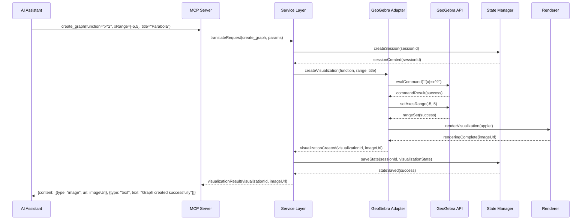
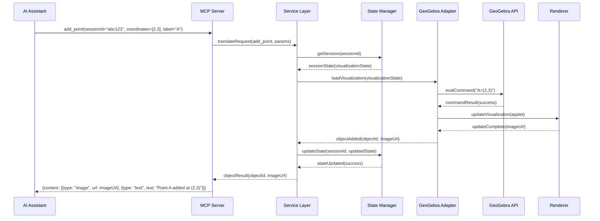
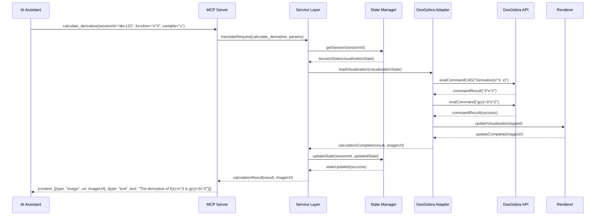
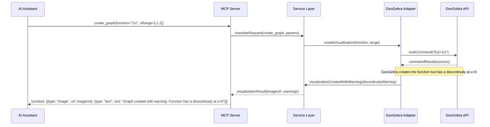
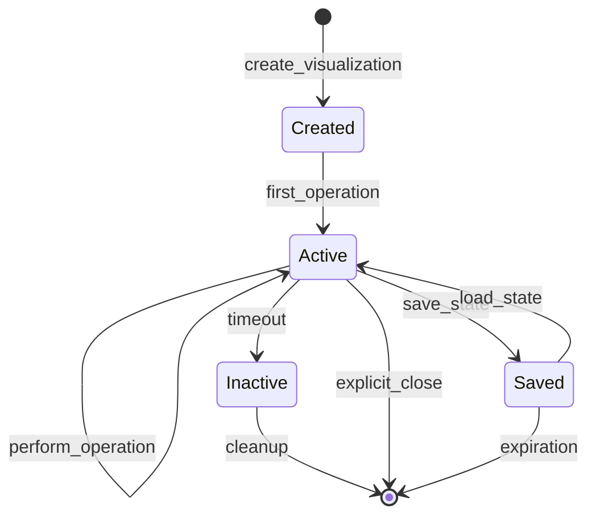

# Data Flow Documentation: MCP-GeoGebra Integration

This document details the data flow between the Model Context Protocol (MCP) and GeoGebra in the integrated system. It covers the main interaction patterns, data transformations, and communication sequences.

## 1. Core Data Flow Patterns

### 1.1 Visualization Creation Flow



### 1.2 Object Manipulation Flow



### 1.3 Calculation Flow



## 2. Data Transformations

### 2.1 MCP Tool Parameters to GeoGebra Commands

| MCP Tool | Parameters | GeoGebra Command | Notes |
|----------|------------|------------------|-------|
| `create_graph` | `function`, `xRange`, `yRange` | `f(x)=<function>` + `setAxesRange()` | Creates a function graph with specified ranges |
| `create_3d_graph` | `function`, `xRange`, `yRange`, `zRange` | `f(x,y)=<function>` + `setAxesRange3D()` | Creates a 3D function graph |
| `add_point` | `coordinates`, `label` | `<label>=(<x>,<y>)` | Adds a labeled point at specified coordinates |
| `add_line` | `point1`, `point2`, `label` | `<label>=Line(<point1>,<point2>)` | Creates a line through two points |
| `calculate_derivative` | `function`, `variable` | `Derivative(<function>, <variable>)` | Calculates derivative using CAS |
| `solve_equation` | `equation`, `variable` | `Solve(<equation>, <variable>)` | Solves equation using CAS |

### 2.2 GeoGebra State Serialization

The state of a GeoGebra visualization is serialized in the following format:

```json
{
  "sessionId": "abc123",
  "appletType": "graphing",
  "objects": [
    {
      "id": "f",
      "type": "function",
      "definition": "f(x)=x^2",
      "color": "#1E88E5",
      "visible": true
    },
    {
      "id": "A",
      "type": "point",
      "coordinates": [2, 3],
      "color": "#D81B60",
      "visible": true
    }
  ],
  "view": {
    "xMin": -5,
    "xMax": 5,
    "yMin": -5,
    "yMax": 5,
    "gridVisible": true
  },
  "timestamp": "2025-05-19T15:30:00Z"
}
```

## 3. Error Propagation

### 3.1 Error Flow Example



### 3.2 Common Error Scenarios and Responses

| Error Scenario | Detection Point | Response Strategy | MCP Response Example |
|----------------|-----------------|-------------------|----------------------|
| Invalid mathematical expression | Service Layer | Return syntax error with suggestion | `{isError: true, content: [{type: "text", text: "Invalid expression: x^@. Did you mean x^2?"}]}` |
| Division by zero | GeoGebra API | Return domain error with visualization of valid parts | `{isError: false, content: [{type: "image", url: imageUrl}, {type: "text", text: "Note: Function has a discontinuity at x=0"}]}` |
| Session not found | State Manager | Return session error with recreation suggestion | `{isError: true, content: [{type: "text", text: "Session expired. Please create a new visualization."}]}` |
| Resource limit exceeded | Service Layer | Return resource error with simplification suggestion | `{isError: true, content: [{type: "text", text: "Visualization too complex. Try simplifying or breaking into parts."}]}` |

## 4. Session Management

### 4.1 Session Lifecycle



### 4.2 Session Data Structure

```json
{
  "sessionId": "abc123",
  "userId": "user456",
  "conversationId": "conv789",
  "createdAt": "2025-05-19T15:00:00Z",
  "lastAccessedAt": "2025-05-19T15:30:00Z",
  "expiresAt": "2025-05-19T16:00:00Z",
  "visualizationState": {
    // GeoGebra state as described in section 2.2
  },
  "visualizationUrl": "https://example.com/vis/abc123.png",
  "interactiveUrl": "https://example.com/interactive/abc123"
}
```

## 5. Data Security Considerations

### 5.1 Data Transmission

- All MCP communication uses HTTPS for data in transit protection
- Authentication tokens are used to validate session access
- Sensitive parameters are validated and sanitized before processing

### 5.2 Data Storage

- Session data is encrypted at rest
- Session IDs are cryptographically secure random values
- Automatic expiration and cleanup of inactive sessions
- No personally identifiable information stored in visualization state

### 5.3 Access Control

- Session access restricted to originating conversation/user
- Resource limits enforced per user/session
- Rate limiting applied to prevent abuse
- Validation of all input parameters against schemas

## 6. Performance Optimization

### 6.1 Data Caching Strategy

- Rendered visualizations cached with appropriate cache keys
- Common mathematical operations results cached
- Session state cached in memory with database backup
- Static GeoGebra resources served from CDN

### 6.2 Payload Optimization

- Visualization images optimized for size/quality balance
- Incremental state updates rather than full state transfer
- Compression used for larger state objects
- Lazy loading of GeoGebra components

This data flow documentation provides a comprehensive view of how data moves between MCP and GeoGebra, including transformations, error handling, and optimization strategies. It serves as a guide for implementing the integration while ensuring robust data management.

