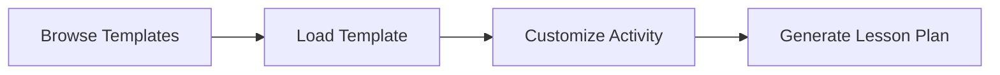

# GeoGebra MCP Tool API Reference

The GeoGebra MCP Tool provides a comprehensive set of Model Context Protocol (MCP) tools that enable AI models to create, manipulate, and analyze mathematical constructions through GeoGebra's powerful mathematical engine.

## 🏗️ Architecture Overview

The MCP tools are organized into four main categories:

### 1. **Basic Tools** (3 tools)
Core MCP functionality including connectivity testing and server information.
- Simple, fast operations for system health checks
- No GeoGebra dependencies
- Used for testing and monitoring

### 2. **GeoGebra Tools** (25+ tools)
Mathematical construction and visualization tools that interface directly with GeoGebra.
- Mathematical object creation (points, lines, circles, polygons)
- Function plotting and graphing
- Algebraic computations and equation solving
- Export capabilities (PNG, SVG, PDF)
- Construction management and manipulation

### 3. **Educational Tools** (10+ tools)
Pre-built educational templates and classroom-focused functionality.
- Curriculum-aligned mathematical activities
- Grade-level appropriate constructions
- Lesson plan generation and management
- Interactive educational scenarios

### 4. **Performance Tools** (5 tools)
Performance monitoring, optimization, and resource management.
- Real-time performance metrics
- Instance pool management
- Resource optimization
- Benchmark testing

## 📋 Tool Categories

| Category | Tool Count | Response Time | Use Cases |
|----------|------------|---------------|-----------|
| [Basic Tools](basic-tools.md) | 3 | < 100ms | Testing, monitoring, server status |
| [GeoGebra Tools](geogebra-tools.md) | 25+ | < 2000ms | Mathematical constructions, plotting |
| [Educational Tools](educational-tools.md) | 10+ | < 2000ms | Classroom activities, lesson plans |
| [Performance Tools](performance-tools.md) | 5 | < 500ms | Optimization, monitoring |

## 🔧 Common Usage Patterns

### 1. **Mathematical Construction Workflow**


**Typical tool sequence:**
1. `geogebra_clear_construction` - Start fresh
2. `geogebra_create_point` - Create basic objects
3. `geogebra_create_line` - Add geometric elements
4. `geogebra_export_png` - Generate visual output

### 2. **Educational Lesson Workflow**


**Typical tool sequence:**
1. `geogebra_list_educational_templates` - Find appropriate activities
2. `geogebra_load_educational_template` - Set up the activity
3. `geogebra_create_lesson_plan` - Generate comprehensive lesson

### 3. **Performance Monitoring Workflow**


**Typical tool sequence:**
1. `performance_warm_up_pool` - Pre-initialize instances
2. `performance_get_stats` - Monitor operation performance
3. `performance_get_pool_stats` - Check resource usage

## 🎯 Tool Selection Guidelines

### For Mathematical Visualization
- **Simple plots**: Use `geogebra_create_function` and `geogebra_plot_function`
- **Geometric constructions**: Start with `geogebra_create_point`, `geogebra_create_line`
- **Complex analysis**: Combine multiple tools in sequence

### For Educational Use
- **Curriculum content**: Use `geogebra_list_educational_templates`
- **Custom activities**: Build with basic GeoGebra tools
- **Lesson planning**: Use `geogebra_create_lesson_plan`

### For Production Systems
- **High performance**: Use `performance_warm_up_pool` at startup
- **Monitoring**: Implement `performance_get_stats` for observability
- **Resource management**: Monitor with `performance_get_pool_stats`

## 📊 Performance Characteristics

### Response Time Requirements
All tools are designed to meet the **< 2 second response time** requirement specified in the PRD:

- **Basic tools**: < 100ms (typically 5-20ms)
- **Simple GeoGebra operations**: 100-500ms
- **Complex constructions**: 500-1500ms
- **Export operations**: 800-1800ms
- **Educational templates**: 200-1000ms

### Resource Usage
- **Memory**: ~10-50MB per GeoGebra instance
- **CPU**: Moderate usage during construction, minimal at idle
- **Network**: Local operations only (no external dependencies)

## 🔀 Tool Input/Output Patterns

### Standard Input Schema
All tools follow consistent parameter patterns:
```typescript
{
  type: 'object',
  properties: {
    // Tool-specific parameters
  },
  required: [] // Required parameters
}
```

### Standard Output Format
All tools return consistent response structures:
```typescript
{
  content: [{
    type: 'text',
    text: string // JSON-formatted response
  }],
  isError?: boolean // Optional error flag
}
```

### Error Handling
All tools implement comprehensive error handling:
- **Validation errors**: Parameter validation with descriptive messages
- **Execution errors**: GeoGebra operation failures with context
- **Resource errors**: Instance pool and memory management issues

## 🔗 Integration Examples

### Basic Integration
```javascript
// Connect to MCP server
const mcpClient = new MCPClient('stdio');

// List available tools
const tools = await mcpClient.call('tools/list');

// Execute a tool
const result = await mcpClient.call('tools/call', {
  name: 'geogebra_create_point',
  arguments: { name: 'A', x: 1, y: 2 }
});
```

### Error Handling
```javascript
try {
  const result = await mcpClient.call('tools/call', {
    name: 'geogebra_eval_command',
    arguments: { command: 'A = (1, 2)' }
  });
  
  const response = JSON.parse(result.content[0].text);
  if (!response.success) {
    console.error('GeoGebra error:', response.error);
  }
} catch (error) {
  console.error('MCP error:', error);
}
```

## 📚 Next Steps

1. **[Basic Tools Reference](basic-tools.md)** - Start with simple connectivity and status tools
2. **[GeoGebra Tools Reference](geogebra-tools.md)** - Explore mathematical construction capabilities
3. **[Educational Tools Reference](educational-tools.md)** - Discover classroom-ready activities
4. **[Performance Tools Reference](performance-tools.md)** - Optimize your implementation

For practical examples, see our [Tutorials](../tutorials/) section or browse [Code Examples](../examples/).

---

**Performance Note**: All tools are designed to meet educational and production requirements with robust error handling and comprehensive logging. For optimal performance in production environments, consider using the performance tools to warm up the instance pool and monitor resource usage. 