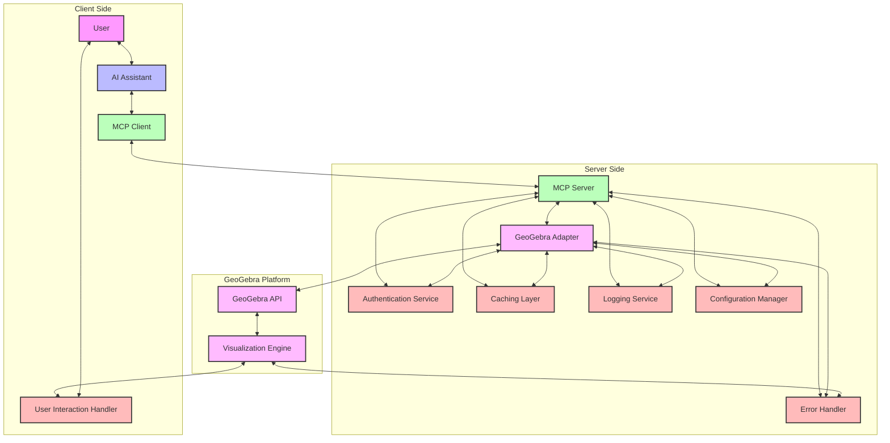

This Mermaid diagram illustrates the architecture for the MCP-GeoGebra integration. It shows the main components and their interactions, organized into three main areas: Client Side, Server Side, and the GeoGebra Platform.

The diagram depicts:
1. The flow of information from the user through the AI assistant to the MCP components
2. How the MCP Server communicates with the GeoGebra Adapter
3. The connection to the GeoGebra API and Visualization Engine
4. Supporting components like Authentication, Caching, Logging, and Configuration
5. The Error Handler's connections to key components

This visual representation complements the detailed architecture document by providing a clear overview of the system structure and data flow.

