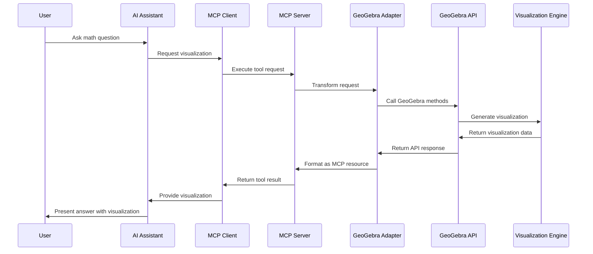
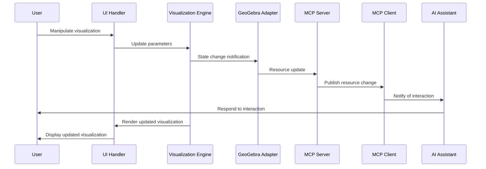
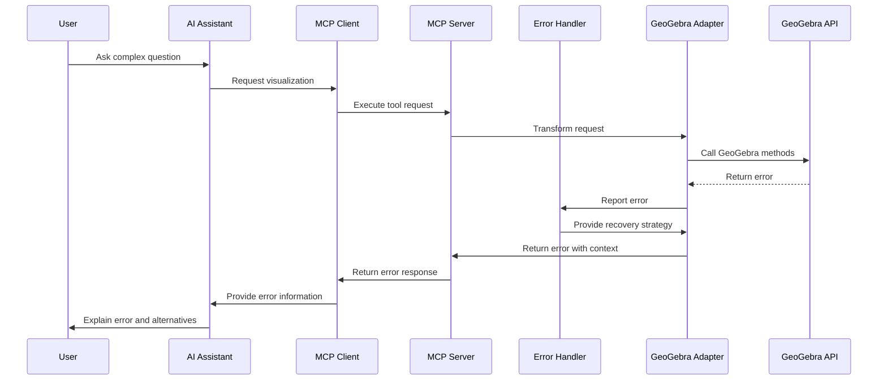
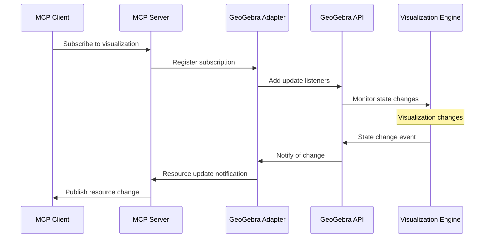
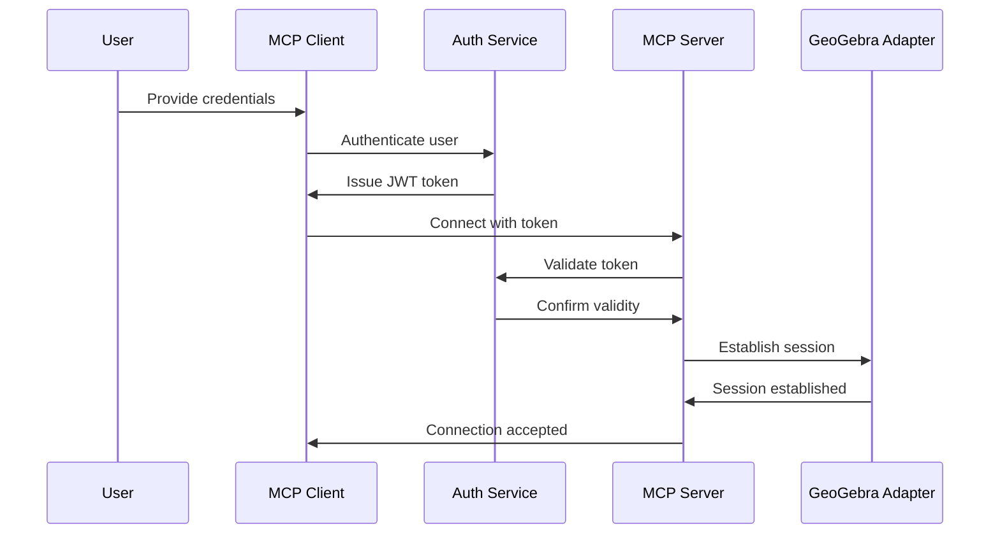
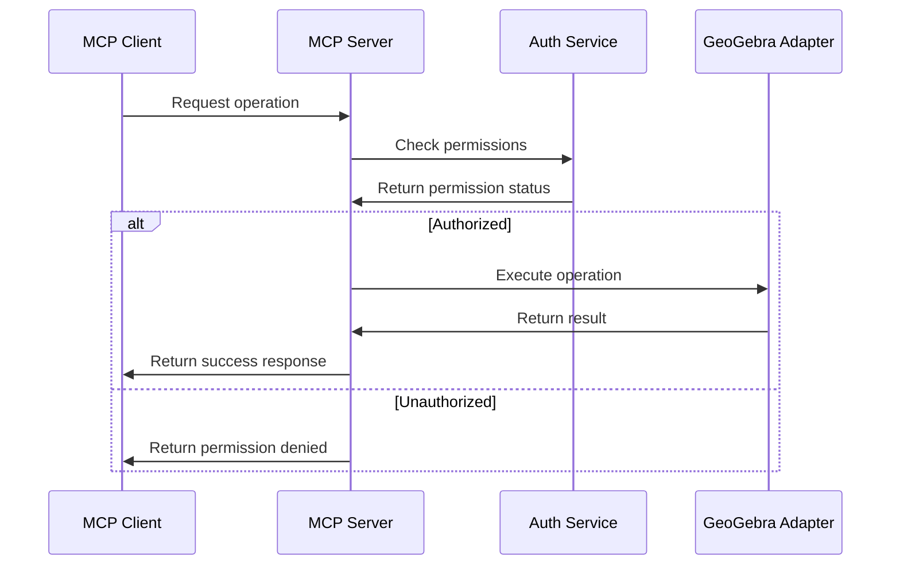

# MCP-GeoGebra Integration: Data Flow Documentation

This document details the data flow between the Model Context Protocol (MCP) and GeoGebra integration components, providing a comprehensive view of how information moves through the system during various operations.

## 1. Request-Response Cycles

### 1.1 Basic Visualization Request



### 1.2 Interactive Visualization Flow



### 1.3 Error Handling Flow



## 2. Data Transformations

### 2.1 MCP Tool Request to GeoGebra API Call

| MCP Tool Request | Transformation | GeoGebra API Call |
|------------------|----------------|-------------------|
| `createGraph2D({ expression: "y=x^2", xRange: [-10, 10], yRange: [-10, 10] })` | Parse expression, set coordinate system | `evalCommand("f(x)=x^2")` + `setCoordSystem(-10, 10, -10, 10)` |
| `solveEquation({ equation: "x^2+2x-3=0", variable: "x" })` | Format as CAS command | `evalCommandCAS("Solve[x^2+2x-3=0, x]")` |
| `calculateDerivative({ function: "x^3+2x", variable: "x", order: 1 })` | Format as derivative command | `evalCommandCAS("Derivative[x^3+2x, x]")` |
| `createGeometricConstruction({ commands: ["A=(1,2)", "B=(4,5)", "Line[A,B]"] })` | Execute sequence of commands | Multiple `evalCommand()` calls in sequence |

### 2.2 GeoGebra Output to MCP Resource

| GeoGebra Output | Transformation | MCP Resource |
|-----------------|----------------|--------------|
| Graph object | Capture as image, extract data points | `{ type: "visualization", format: "image/png", data: "base64...", interactiveUrl: "...", dataPoints: [...] }` |
| CAS result | Format result, generate visualization | `{ type: "result", format: "text/plain", value: "x = 1 or x = -3", visualization: { ... } }` |
| Geometric construction | Capture as interactive scene | `{ type: "interactive", format: "application/geogebra", data: "...", objects: [...], commands: [...] }` |
| Error | Format with context and recovery options | `{ type: "error", code: "MATH_ERROR_001", message: "...", recoverable: true, alternatives: [...] }` |

## 3. State Management

### 3.1 Visualization State

The visualization state is maintained as a JSON object that includes:

```json
{
  "id": "viz-12345",
  "type": "2d-graph",
  "expressions": [
    { "id": "f1", "value": "y=x^2", "color": "#FF0000", "visible": true },
    { "id": "f2", "value": "y=2x+1", "color": "#0000FF", "visible": true }
  ],
  "view": {
    "xMin": -10,
    "xMax": 10,
    "yMin": -10,
    "yMax": 10,
    "xScale": 1,
    "yScale": 1
  },
  "objects": [
    { "id": "A", "type": "point", "coordinates": [2, 4], "visible": true },
    { "id": "B", "type": "point", "coordinates": [5, 7], "visible": true },
    { "id": "l1", "type": "line", "definition": "Line[A,B]", "visible": true }
  ],
  "settings": {
    "grid": true,
    "axes": true,
    "labels": true
  },
  "interactionMode": "pan"
}
```

### 3.2 Session State

The session state tracks the ongoing interaction between the user, AI, and visualization:

```json
{
  "sessionId": "session-67890",
  "userId": "user-12345",
  "createdAt": "2025-05-19T10:30:00Z",
  "lastActivity": "2025-05-19T10:35:22Z",
  "visualizations": [
    { "id": "viz-12345", "type": "2d-graph", "active": true },
    { "id": "viz-12346", "type": "3d-surface", "active": false }
  ],
  "history": [
    {
      "timestamp": "2025-05-19T10:30:15Z",
      "action": "create_visualization",
      "parameters": { "expression": "y=x^2" }
    },
    {
      "timestamp": "2025-05-19T10:32:30Z",
      "action": "modify_visualization",
      "parameters": { "expression": "y=x^2+1" }
    }
  ],
  "permissions": {
    "allowInteraction": true,
    "allowExport": true,
    "allowSharing": false
  }
}
```

## 4. Resource Subscription Flow



## 5. Error Categories and Handling

| Error Category | Example | Handling Strategy |
|----------------|---------|-------------------|
| **Invalid Expression** | `y=x/0` | - Detect division by zero<br>- Return specific error code<br>- Suggest alternative expression |
| **Rendering Limitation** | Complex 3D surface with too many points | - Detect performance issue<br>- Simplify visualization<br>- Notify of simplification |
| **Unsupported Operation** | Attempt to solve non-algebraic equation | - Identify operation type<br>- Return capability error<br>- Suggest numerical approximation |
| **Resource Limitation** | Too many objects in construction | - Monitor resource usage<br>- Enforce limits<br>- Suggest splitting into multiple visualizations |
| **Connection Failure** | GeoGebra API unavailable | - Implement timeout<br>- Retry with backoff<br>- Fall back to simplified visualization |

## 6. Security Flow

### 6.1 Authentication Flow



### 6.2 Authorization Flow



## 7. Conclusion

This data flow documentation provides a detailed view of how information moves through the MCP-GeoGebra integration system. By understanding these flows, developers can implement the system with a clear understanding of component interactions, state management, and error handling strategies.

The sequence diagrams illustrate the temporal relationships between components, while the data transformation tables show how information is converted between different formats. The state management section provides templates for maintaining consistent system state, and the error handling section outlines strategies for graceful failure recovery.

