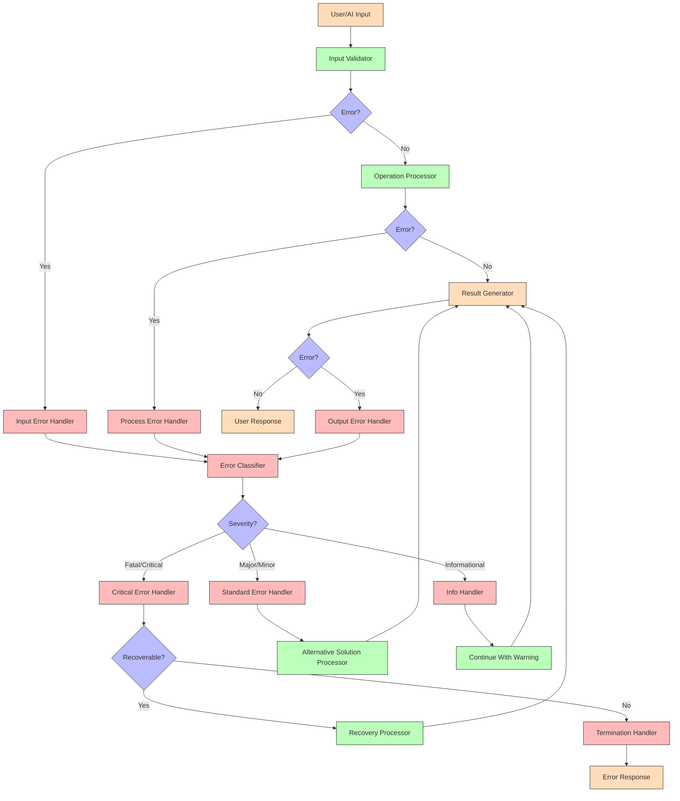

# MCP-GeoGebra Integration: Error Handling Strategy

This document outlines the comprehensive error handling strategy for the MCP-GeoGebra integration. It defines error categories, handling approaches, recovery mechanisms, and implementation guidelines to ensure a robust and user-friendly system.

## 1. Error Classification Framework

### 1.1 Error Categories

| Category | Description | Subcategories |
|----------|-------------|---------------|
| **Protocol Errors** | Errors in MCP communication | - Message format errors<br>- Protocol version mismatches<br>- Missing required parameters<br>- Invalid parameter types |
| **Mathematical Errors** | Errors in mathematical operations | - Syntax errors<br>- Semantic errors<br>- Undefined operations<br>- Convergence failures |
| **Visualization Errors** | Errors in rendering visualizations | - Rendering failures<br>- Resource limitations<br>- Unsupported visualization types<br>- Display constraints |
| **Integration Errors** | Errors in system integration | - API connection failures<br>- Authentication failures<br>- Version incompatibilities<br>- Timeout errors |
| **User Input Errors** | Errors from invalid user inputs | - Out-of-range parameters<br>- Invalid expressions<br>- Unsupported operations<br>- Input constraints |

### 1.2 Error Severity Levels

| Level | Name | Description | Response Strategy |
|-------|------|-------------|-------------------|
| 1 | **Fatal** | System cannot continue operation | - Log error<br>- Notify user<br>- Terminate session<br>- Require manual restart |
| 2 | **Critical** | Major functionality is impaired | - Log error<br>- Notify user<br>- Attempt recovery<br>- Fall back to alternative functionality |
| 3 | **Major** | Significant feature is unavailable | - Log error<br>- Notify user<br>- Continue with limited functionality<br>- Suggest alternatives |
| 4 | **Minor** | Non-essential feature is affected | - Log error<br>- Notify user (non-intrusively)<br>- Continue with main functionality<br>- Offer workarounds |
| 5 | **Informational** | Potential issue or optimization opportunity | - Log information<br>- Continue normal operation<br>- Suggest improvements (if appropriate) |

## 2. Error Detection Mechanisms

### 2.1 Proactive Validation

| Validation Type | Implementation | Examples |
|-----------------|----------------|----------|
| **Schema Validation** | JSON Schema validation for all requests and responses | - Validate MCP message structure<br>- Check parameter types and constraints<br>- Ensure required fields are present |
| **Mathematical Validation** | Pre-execution analysis of mathematical expressions | - Check for division by zero<br>- Validate domain constraints<br>- Detect potential overflow/underflow |
| **Resource Validation** | Check resource availability before operations | - Verify memory availability for complex visualizations<br>- Check API rate limits<br>- Validate session permissions |
| **Semantic Validation** | Validate operation semantics beyond syntax | - Ensure mathematical operations are well-defined<br>- Verify geometric constructions are valid<br>- Check for circular references |

### 2.2 Runtime Monitoring

| Monitoring Type | Implementation | Response |
|-----------------|----------------|----------|
| **Performance Monitoring** | Track execution time and resource usage | - Abort operations exceeding thresholds<br>- Scale down complexity automatically<br>- Log performance bottlenecks |
| **State Consistency Checks** | Verify system state integrity during operations | - Detect inconsistent object states<br>- Identify corrupted visualization data<br>- Validate state transitions |
| **Exception Tracking** | Catch and classify all exceptions | - Map exceptions to error categories<br>- Extract relevant context information<br>- Generate appropriate error responses |
| **Health Checks** | Periodic verification of system components | - Check GeoGebra API connectivity<br>- Verify MCP server responsiveness<br>- Validate cache integrity |

## 3. Error Response Strategy

### 3.1 Error Response Format

```typescript
interface ErrorResponse {
  // Core error information
  code: string;           // Unique error identifier (e.g., "MATH_ERROR_001")
  category: string;       // Error category (e.g., "MATHEMATICAL_ERROR")
  severity: number;       // Severity level (1-5)
  message: string;        // User-friendly error message
  
  // Context information
  context?: {
    operation: string;    // Operation being performed
    input?: any;          // Sanitized input that caused the error
    location?: string;    // Component/module where error occurred
  };
  
  // Technical details (for logging/debugging)
  details?: {
    technicalMessage: string;  // Technical error description
    stackTrace?: string;       // Stack trace (server-side only)
    timestamp: string;         // Error timestamp
  };
  
  // Recovery information
  recovery: {
    recoverable: boolean;      // Whether automatic recovery is possible
    retryable: boolean;        // Whether retry might succeed
    alternatives?: string[];   // Alternative approaches
    suggestedAction?: string;  // Recommended user action
  };
}
```

### 3.2 User-Facing Error Messages

| Error Type | Message Style | Example |
|------------|--------------|---------|
| **Syntax Error** | Specific with correction suggestion | "Invalid expression 'y=x+)'. Check the parentheses in your expression." |
| **Undefined Operation** | Explanatory with mathematical context | "Cannot calculate square root of negative number in real domain. Consider using complex numbers." |
| **Resource Limitation** | Clear with alternative suggestion | "The 3D visualization is too complex for rendering. Try reducing the number of points or using a 2D representation." |
| **Connection Error** | Transparent with status | "Unable to connect to GeoGebra service (Timeout). Please try again in a few moments." |
| **Permission Error** | Informative with action guidance | "You don't have permission to create this type of visualization. Please contact your administrator." |

## 4. Recovery Mechanisms

### 4.1 Automatic Recovery Strategies

| Strategy | Application | Implementation |
|----------|-------------|----------------|
| **Retry with Backoff** | Transient failures | - Implement exponential backoff<br>- Set maximum retry attempts<br>- Track retry history |
| **Graceful Degradation** | Resource limitations | - Fall back to simpler visualization<br>- Reduce precision/complexity<br>- Limit interactive features |
| **Alternative Computation** | Mathematical limitations | - Try alternative algorithms<br>- Use numerical approximation<br>- Switch computation methods |
| **State Restoration** | State corruption | - Maintain state snapshots<br>- Implement rollback capability<br>- Recreate from saved commands |
| **Service Switching** | Integration failures | - Maintain backup services<br>- Implement service discovery<br>- Support multiple GeoGebra endpoints |

### 4.2 User-Assisted Recovery

| Approach | User Experience | Implementation |
|----------|----------------|----------------|
| **Guided Correction** | Highlight issues and suggest fixes | - Provide specific error locations<br>- Offer auto-correction options<br>- Show examples of valid input |
| **Alternative Suggestions** | Offer different approaches | - Suggest simpler expressions<br>- Recommend alternative visualization types<br>- Provide educational explanations |
| **Interactive Debugging** | Allow user to explore the issue | - Provide visualization of error context<br>- Allow step-by-step execution<br>- Show intermediate results |
| **Feedback Collection** | Learn from user responses | - Collect error resolution feedback<br>- Track successful recovery paths<br>- Improve suggestions based on user actions |

## 5. Implementation Guidelines

### 5.1 Error Handling Architecture



### 5.2 Error Logging Strategy

| Log Level | Usage | Content |
|-----------|-------|---------|
| **ERROR** | Fatal and Critical errors | - Full error details including stack trace<br>- Complete context information<br>- User and session identifiers<br>- Recovery attempts |
| **WARN** | Major errors and recovery actions | - Error summary<br>- Context information<br>- Recovery strategy applied<br>- Performance impacts |
| **INFO** | Minor errors and system events | - Brief error description<br>- Affected functionality<br>- Normal operation events<br>- Recovery success |
| **DEBUG** | Detailed diagnostic information | - Detailed operation steps<br>- State transitions<br>- Validation results<br>- Performance metrics |
| **TRACE** | Low-level execution details | - Method entry/exit<br>- Parameter values<br>- Intermediate results<br>- Resource usage |

### 5.3 Error Code Structure

Error codes follow the format: `[CATEGORY]_[SUBCATEGORY]_[SEQUENCE]`

Examples:
- `PROTO_FORMAT_001`: Protocol format error (first of its type)
- `MATH_SYNTAX_003`: Mathematical syntax error (third of its type)
- `VIZ_RENDER_002`: Visualization rendering error (second of its type)
- `INTEG_CONN_005`: Integration connection error (fifth of its type)
- `INPUT_RANGE_001`: Input range error (first of its type)

## 6. Common Error Scenarios and Handling

### 6.1 Mathematical Expression Errors

| Error | Example | Handling |
|-------|---------|----------|
| **Syntax Error** | `y=x+*2` | - Highlight error location<br>- Suggest correction (`y=x+2` or `y=x*2`)<br>- Provide syntax guide |
| **Division by Zero** | `y=1/x` at x=0 | - Detect singularity<br>- Exclude point from visualization<br>- Add visual indicator for discontinuity |
| **Domain Error** | `y=log(x)` for x≤0 | - Restrict domain in visualization<br>- Show valid domain in message<br>- Visualize only valid portion |
| **Overflow/Underflow** | Very large/small values | - Detect numerical issues<br>- Scale visualization appropriately<br>- Indicate scale adjustments to user |

### 6.2 Visualization Rendering Errors

| Error | Example | Handling |
|-------|---------|----------|
| **Complexity Limit** | 3D surface with too many points | - Reduce resolution automatically<br>- Notify user of simplification<br>- Offer progressive rendering option |
| **Unsupported Type** | Visualization not supported in current view | - Suggest alternative visualization type<br>- Explain limitation<br>- Offer to switch view mode |
| **Rendering Failure** | WebGL not supported by browser | - Detect capability before rendering<br>- Fall back to simpler rendering<br>- Explain browser limitation |
| **Performance Issue** | Visualization causes slowdown | - Monitor performance metrics<br>- Simplify automatically if needed<br>- Allow user to adjust quality |

### 6.3 Integration and Connection Errors

| Error | Example | Handling |
|-------|---------|----------|
| **API Unavailable** | GeoGebra service unreachable | - Implement timeout<br>- Retry with backoff<br>- Offer offline alternatives |
| **Authentication Failure** | Invalid or expired credentials | - Detect token issues proactively<br>- Refresh tokens when possible<br>- Guide user through reauthentication |
| **Version Mismatch** | Incompatible API versions | - Check compatibility before operations<br>- Adapt requests when possible<br>- Clearly explain version constraints |
| **Rate Limiting** | Too many requests to GeoGebra API | - Implement request queuing<br>- Add rate limiting awareness<br>- Prioritize critical operations |

## 7. Testing and Validation

### 7.1 Error Scenario Testing

| Test Type | Approach | Examples |
|-----------|----------|----------|
| **Unit Tests** | Test individual error handlers | - Verify correct classification<br>- Validate recovery mechanisms<br>- Check error response format |
| **Integration Tests** | Test error handling across components | - Verify error propagation<br>- Test recovery coordination<br>- Validate logging consistency |
| **Chaos Testing** | Deliberately introduce failures | - Simulate API outages<br>- Inject malformed responses<br>- Create resource constraints |
| **User Experience Tests** | Evaluate error messages with users | - Assess message clarity<br>- Test recovery guidance<br>- Evaluate alternative suggestions |

### 7.2 Error Monitoring and Improvement

| Activity | Implementation | Benefits |
|----------|----------------|----------|
| **Error Analytics** | Track error frequencies and patterns | - Identify common issues<br>- Prioritize improvements<br>- Detect emerging problems |
| **Recovery Success Tracking** | Measure effectiveness of recovery strategies | - Improve recovery mechanisms<br>- Identify unsuccessful strategies<br>- Optimize retry parameters |
| **User Feedback Collection** | Gather feedback on error handling | - Improve error messages<br>- Enhance recovery suggestions<br>- Identify missing error cases |
| **Continuous Improvement** | Regular review and enhancement | - Update error handling based on data<br>- Refine error categories<br>- Improve recovery strategies |

## 8. Conclusion

This comprehensive error handling strategy provides a robust framework for managing errors in the MCP-GeoGebra integration. By implementing this strategy, the system will:

1. **Detect errors early** through proactive validation and runtime monitoring
2. **Respond appropriately** with clear, user-friendly messages
3. **Recover effectively** using automatic and user-assisted recovery mechanisms
4. **Learn and improve** through continuous monitoring and feedback

The strategy balances technical robustness with user experience considerations, ensuring that errors are handled gracefully while providing users with the information and tools they need to continue their work effectively.

