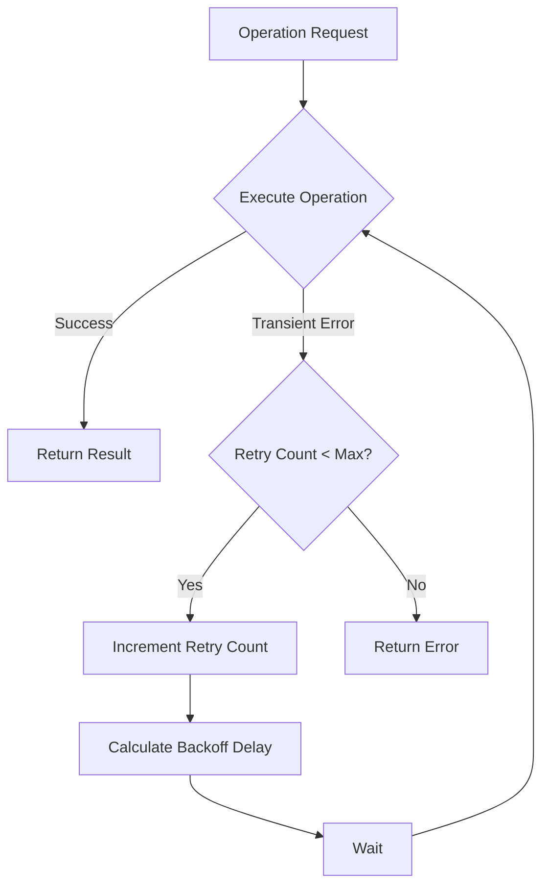

# Error Handling Strategy: MCP-GeoGebra Integration

This document outlines the comprehensive error handling strategy for the MCP-GeoGebra integration. It defines error categories, detection mechanisms, reporting formats, and recovery procedures to ensure a robust and resilient system.

## 1. Error Categorization

### 1.1 Protocol Errors

Errors related to the MCP protocol communication layer.

| Error Code | Description | Possible Causes | Severity |
|------------|-------------|-----------------|----------|
| `PROTOCOL_VERSION_MISMATCH` | Incompatible protocol versions | Client using outdated MCP version | High |
| `INVALID_REQUEST_FORMAT` | Malformed request structure | Incorrect JSON format, missing required fields | Medium |
| `REQUEST_TIMEOUT` | Request processing exceeded time limit | Network issues, server overload | Medium |
| `TRANSPORT_ERROR` | Communication transport failure | Network disconnection, server crash | High |

### 1.2 Parameter Validation Errors

Errors related to invalid or inappropriate parameters in tool calls.

| Error Code | Description | Possible Causes | Severity |
|------------|-------------|-----------------|----------|
| `INVALID_FUNCTION_SYNTAX` | Mathematical function syntax error | Typos, incorrect notation | Medium |
| `PARAMETER_OUT_OF_RANGE` | Parameter value outside acceptable range | Extreme values, incorrect units | Low |
| `MISSING_REQUIRED_PARAMETER` | Required parameter not provided | Incomplete request | Medium |
| `INVALID_SESSION_ID` | Session identifier not valid | Expired session, incorrect ID | Medium |
| `INCOMPATIBLE_PARAMETERS` | Parameter combination not supported | Conflicting options | Medium |

### 1.3 GeoGebra API Errors

Errors originating from the GeoGebra JavaScript API.

| Error Code | Description | Possible Causes | Severity |
|------------|-------------|-----------------|----------|
| `GEOGEBRA_INITIALIZATION_FAILED` | GeoGebra applet failed to initialize | Resource issues, compatibility problems | High |
| `COMMAND_EXECUTION_FAILED` | GeoGebra command failed to execute | Invalid command, internal GeoGebra error | Medium |
| `MATHEMATICAL_DOMAIN_ERROR` | Mathematical operation outside valid domain | Division by zero, logarithm of negative number | Low |
| `OBJECT_NOT_FOUND` | Referenced object does not exist | Incorrect object name, deleted object | Medium |
| `APPLET_TIMEOUT` | GeoGebra applet operation timed out | Complex calculation, resource limitation | Medium |

### 1.4 Rendering Errors

Errors related to visualization rendering.

| Error Code | Description | Possible Causes | Severity |
|------------|-------------|-----------------|----------|
| `RENDERING_FAILED` | Visualization could not be rendered | Resource limitations, internal error | High |
| `EXPORT_FORMAT_ERROR` | Failed to export in requested format | Unsupported format, conversion error | Medium |
| `VISUALIZATION_TOO_COMPLEX` | Visualization exceeds complexity limits | Too many objects, excessive detail | Medium |
| `CANVAS_SIZE_ERROR` | Canvas dimensions issue | Invalid size parameters | Low |

### 1.5 State Management Errors

Errors related to session and state management.

| Error Code | Description | Possible Causes | Severity |
|------------|-------------|-----------------|----------|
| `SESSION_EXPIRED` | Session has expired | Timeout, explicit closure | Medium |
| `STATE_SAVE_FAILED` | Failed to save visualization state | Storage issues, serialization error | High |
| `STATE_LOAD_FAILED` | Failed to load visualization state | Corrupted state, compatibility issue | High |
| `SESSION_LIMIT_EXCEEDED` | User exceeded session limit | Too many active sessions | Low |

### 1.6 Resource Errors

Errors related to system resources.

| Error Code | Description | Possible Causes | Severity |
|------------|-------------|-----------------|----------|
| `MEMORY_LIMIT_EXCEEDED` | Operation exceeded memory allocation | Large visualization, memory leak | High |
| `CPU_LIMIT_EXCEEDED` | Operation exceeded CPU time allocation | Infinite loop, complex calculation | High |
| `STORAGE_LIMIT_EXCEEDED` | User exceeded storage allocation | Too many saved visualizations | Medium |
| `RATE_LIMIT_EXCEEDED` | Too many requests in time period | Rapid requests, potential abuse | Medium |

## 2. Error Detection Mechanisms

### 2.1 Input Validation

- **Schema Validation**: All MCP tool parameters validated against JSON Schema
- **Mathematical Expression Parsing**: Syntax checking before execution
- **Range Validation**: Numerical parameters checked against acceptable ranges
- **Type Checking**: Parameter types verified before processing

### 2.2 Runtime Monitoring

- **Timeout Monitoring**: Operations monitored for execution time
- **Resource Usage Tracking**: Memory and CPU usage monitored
- **GeoGebra API Error Capture**: Error events from GeoGebra captured and processed
- **State Consistency Checks**: Visualization state validated for consistency

### 2.3 Health Checks

- **Component Health Monitoring**: Regular checks of system components
- **GeoGebra Applet Verification**: Verification of applet responsiveness
- **Storage System Checks**: Validation of state storage system
- **Network Connectivity Tests**: Verification of communication channels

## 3. Error Reporting

### 3.1 MCP Error Response Format

```json
{
  "isError": true,
  "content": [
    {
      "type": "text",
      "text": "Error: Unable to create graph for function f(x) = 1/x at x=0"
    }
  ],
  "errorCode": "MATHEMATICAL_DOMAIN_ERROR",
  "errorDetails": {
    "function": "f(x) = 1/x",
    "domain": "x=0",
    "suggestion": "Try defining the function with a domain that excludes x=0"
  }
}
```

### 3.2 Error Logging Structure

```json
{
  "timestamp": "2025-05-19T15:35:22.123Z",
  "errorCode": "MATHEMATICAL_DOMAIN_ERROR",
  "severity": "medium",
  "sessionId": "abc123",
  "userId": "user456",
  "request": {
    "tool": "create_graph",
    "parameters": {
      "function": "1/x",
      "xRange": [-1, 1]
    }
  },
  "errorDetails": {
    "function": "f(x) = 1/x",
    "domain": "x=0",
    "stackTrace": "..."
  },
  "context": {
    "appletType": "graphing",
    "browserInfo": "...",
    "systemLoad": 0.75
  }
}
```

### 3.3 User-Facing Error Messages

| Error Category | Message Template | Example |
|----------------|------------------|---------|
| Syntax Error | "There's a syntax error in the {element}: {details}. {suggestion}" | "There's a syntax error in the function: Missing closing parenthesis. Try adding a ')' at the end." |
| Domain Error | "The {operation} cannot be performed because {reason}. {suggestion}" | "The division cannot be performed because the denominator is zero. Try using a different function or excluding x=0 from the domain." |
| Resource Error | "The {resource} limit has been reached. {suggestion}" | "The complexity limit has been reached. Try simplifying your visualization or breaking it into multiple parts." |
| Session Error | "Your session has {status}. {action}" | "Your session has expired. Please create a new visualization to continue." |

## 4. Error Recovery Strategies

### 4.1 Automatic Retry Mechanism

- **Transient Errors**: Automatically retry operations for transient failures
- **Exponential Backoff**: Increase delay between retries
- **Retry Limits**: Maximum number of retry attempts before failing
- **Idempotency**: Ensure operations can be safely retried



### 4.2 Graceful Degradation

- **Partial Results**: Return partial results when possible
- **Simplified Visualization**: Fall back to simpler rendering
- **Feature Reduction**: Disable advanced features under resource constraints
- **Alternative Calculation Methods**: Use alternative algorithms when primary method fails

### 4.3 Session Recovery

- **State Snapshots**: Regular snapshots of visualization state
- **Automatic Session Restoration**: Restore from last known good state
- **Incremental State Updates**: Track changes to enable partial recovery
- **Session Migration**: Move sessions between servers if needed

### 4.4 User Guidance

- **Actionable Error Messages**: Provide clear next steps in error messages
- **Suggested Corrections**: Offer potential fixes for common errors
- **Alternative Approaches**: Suggest different ways to achieve the same goal
- **Documentation Links**: Provide links to relevant documentation

## 5. Error Prevention Strategies

### 5.1 Input Sanitization

- **Expression Normalization**: Standardize mathematical expressions
- **Parameter Bounds Enforcement**: Clamp values to acceptable ranges
- **Default Values**: Provide sensible defaults for optional parameters
- **Input Transformation**: Convert between equivalent formats as needed

### 5.2 Predictive Validation

- **Pre-execution Validation**: Validate operations before execution
- **Complexity Estimation**: Estimate resource requirements before execution
- **Domain Analysis**: Analyze mathematical domains for potential issues
- **Parameter Compatibility Check**: Verify parameter combinations are valid

### 5.3 Progressive Enhancement

- **Start Simple**: Begin with basic visualization and add complexity
- **Incremental Rendering**: Render visualization in stages
- **Feature Detection**: Enable features based on available resources
- **Adaptive Complexity**: Adjust detail level based on performance

## 6. Implementation Guidelines

### 6.1 Error Handling in MCP Server Layer

```typescript
// Example error handling in MCP tool handler
server.setRequestHandler(CallToolRequestSchema, async (request) => {
  try {
    // Validate parameters
    const validationResult = validateParameters(request.params);
    if (!validationResult.isValid) {
      return createErrorResponse(
        "PARAMETER_VALIDATION_ERROR",
        `Invalid parameters: ${validationResult.message}`,
        validationResult.details
      );
    }
    
    // Process request
    const result = await processToolRequest(request.params);
    return result;
  } catch (error) {
    // Log detailed error
    logger.error("Tool execution failed", {
      tool: request.params.name,
      error: error.message,
      stack: error.stack,
      request: request.params
    });
    
    // Return appropriate error response
    if (error instanceof GeoGebraApiError) {
      return createErrorResponse(
        "GEOGEBRA_API_ERROR",
        `GeoGebra operation failed: ${error.message}`,
        error.details
      );
    } else if (error instanceof SessionError) {
      return createErrorResponse(
        "SESSION_ERROR",
        `Session operation failed: ${error.message}`,
        error.details
      );
    } else {
      return createErrorResponse(
        "INTERNAL_ERROR",
        "An unexpected error occurred",
        { suggestion: "Please try again or contact support" }
      );
    }
  }
});

function createErrorResponse(code, message, details = {}) {
  return {
    isError: true,
    content: [
      {
        type: "text",
        text: message
      }
    ],
    errorCode: code,
    errorDetails: details
  };
}
```

### 6.2 Error Handling in GeoGebra Adapter Layer

```typescript
// Example error handling in GeoGebra adapter
class GeoGebraAdapter {
  async executeCommand(command) {
    return new Promise((resolve, reject) => {
      try {
        // Set timeout for command execution
        const timeoutId = setTimeout(() => {
          reject(new GeoGebraApiError(
            "APPLET_TIMEOUT",
            "Command execution timed out",
            { command }
          ));
        }, this.commandTimeout);
        
        // Execute command
        const success = this.applet.evalCommand(command);
        clearTimeout(timeoutId);
        
        if (!success) {
          // Check for specific error conditions
          const errorMessage = this.applet.getErrorMessage();
          if (errorMessage.includes("Division by zero")) {
            reject(new GeoGebraApiError(
              "MATHEMATICAL_DOMAIN_ERROR",
              "Division by zero",
              { 
                command,
                suggestion: "Ensure your function doesn't divide by zero" 
              }
            ));
          } else {
            reject(new GeoGebraApiError(
              "COMMAND_EXECUTION_FAILED",
              errorMessage || "Command execution failed",
              { command }
            ));
          }
        } else {
          resolve(true);
        }
      } catch (error) {
        reject(new GeoGebraApiError(
          "GEOGEBRA_INTERNAL_ERROR",
          error.message,
          { command, originalError: error.toString() }
        ));
      }
    });
  }
}
```

### 6.3 Error Handling in State Management Layer

```typescript
// Example error handling in state management
class SessionManager {
  async getSession(sessionId) {
    try {
      // Validate session ID format
      if (!this.isValidSessionId(sessionId)) {
        throw new SessionError(
          "INVALID_SESSION_ID",
          "Invalid session ID format",
          { sessionId }
        );
      }
      
      // Attempt to retrieve session
      const session = await this.sessionStore.get(sessionId);
      
      // Check if session exists
      if (!session) {
        throw new SessionError(
          "SESSION_NOT_FOUND",
          "Session not found",
          { 
            sessionId,
            suggestion: "Create a new session or check the session ID" 
          }
        );
      }
      
      // Check if session has expired
      if (this.isSessionExpired(session)) {
        throw new SessionError(
          "SESSION_EXPIRED",
          "Session has expired",
          { 
            sessionId,
            expiredAt: session.expiresAt,
            suggestion: "Create a new session to continue" 
          }
        );
      }
      
      // Update last accessed time
      await this.updateSessionAccess(sessionId);
      
      return session;
    } catch (error) {
      // Rethrow SessionError instances
      if (error instanceof SessionError) {
        throw error;
      }
      
      // Handle storage errors
      throw new SessionError(
        "SESSION_RETRIEVAL_ERROR",
        "Failed to retrieve session",
        { 
          sessionId,
          cause: error.message,
          suggestion: "Try again or create a new session" 
        }
      );
    }
  }
}
```

## 7. Testing Strategy for Error Handling

### 7.1 Unit Testing

- Test individual error detection mechanisms
- Verify error response formats
- Test retry logic and backoff algorithms
- Validate input sanitization functions

### 7.2 Integration Testing

- Test error propagation across system boundaries
- Verify error handling between components
- Test recovery mechanisms end-to-end
- Validate logging and monitoring integration

### 7.3 Chaos Testing

- Simulate resource constraints (memory, CPU)
- Inject network failures and latency
- Force component failures
- Test system under high load conditions

### 7.4 User Experience Testing

- Verify error messages are clear and actionable
- Test accessibility of error notifications
- Validate error recovery from user perspective
- Ensure errors don't result in data loss

## 8. Monitoring and Continuous Improvement

### 8.1 Error Metrics

- **Error Rate**: Percentage of requests resulting in errors
- **Error Distribution**: Breakdown of errors by category
- **Recovery Rate**: Percentage of errors successfully recovered
- **Mean Time to Recovery**: Average time to recover from errors

### 8.2 Alerting Thresholds

| Metric | Warning Threshold | Critical Threshold | Action |
|--------|-------------------|-------------------|--------|
| Error Rate | >5% | >10% | Investigate common error patterns |
| Critical Errors | >0 | >5 per hour | Immediate investigation |
| Recovery Failures | >1% | >5% | Review recovery mechanisms |
| Resource Errors | >1% | >5% | Scale resources or optimize usage |

### 8.3 Continuous Improvement Process

1. **Collect Error Data**: Gather comprehensive error information
2. **Analyze Patterns**: Identify common error scenarios and root causes
3. **Prioritize Improvements**: Focus on high-impact, frequent errors
4. **Implement Solutions**: Add validation, improve error handling, enhance recovery
5. **Measure Impact**: Track error metrics before and after changes
6. **Document Learnings**: Update error handling documentation with new patterns

This error handling strategy provides a comprehensive framework for detecting, reporting, and recovering from errors in the MCP-GeoGebra integration. By implementing these approaches, the system will be more robust, resilient, and user-friendly, even when unexpected conditions occur.

